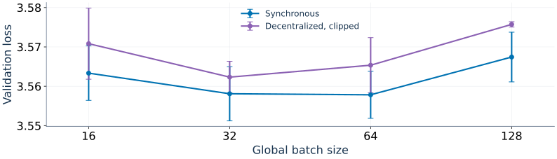

# tiny-llm

Small language models, measured carefully. Compare learning-rate schedules and
decentralized training, reproduce the experiments, and inspect gradient noise
and the loss Hessian.

**[Research website](https://wangzesen.github.io/tiny-llm/)** ·
[Interactive results](https://wangzesen.github.io/tiny-llm/results/explorer/) ·
[Experimental protocol](doc/methods/protocol.md)

## Small-batch AdamW investigation

At a fixed 408M-target budget and context 512, the best observed synchronous and
clipped four-worker decentralized recipes use global batches **64 and 32**, respectively.
Smaller batches favor longer Adam moment memory. Tuned clipped decentralized
training comes close to synchronous quality; clipping helps more at larger batches
within the tested common grid, despite acting most frequently at the smallest
decentralized local batch. Tuning procedures differ, so comparisons are exploratory.

[](doc/small-batchsize-investigation/assets/quality.pdf)

[Investigation, report, and slides](https://wangzesen.github.io/tiny-llm/results/small-batchsize-investigation/) ·
[13-slide presentation](doc/small-batchsize-investigation/slides.pdf) ·
[Report and technical appendix](doc/small-batchsize-investigation/report.pdf)

## Latest tuning results

Cosine-to-zero and warmup-stable-decay (WSD), with 20.4M-parameter models on C4.
The shared horizons are 20, 40, and 80 global tokens per parameter. Results cover
1,188 independent cosine runs and 594 WSD seed/horizon results; WSD continuations
share earlier training history.

Synchronous training has the lowest selected mean loss at each shared horizon.
The gap between synchronous and decentralized cosine training narrows with the
training budget. Cosine has lower selected means than WSD at the shared horizons
for both measured methods. These are separately tuned recipes with different
search grids and training histories; the comparison does not isolate schedule alone.

<!-- results:start -->

| Schedule | Training mode | Tokens/parameter | LR | β₁ | β₂ | Final loss ± sample SD |
| --- | --- | ---: | ---: | ---: | ---: | ---: |
| Cosine-to-zero | Synchronous | 20 | 0.01 | 0.9 | 0.99 | 3.549818 ± 0.003284 |
| Cosine-to-zero | Four workers | 20 | 0.01 | 0.95 | 0.99 | 3.570302 ± 0.004893 |
| Cosine-to-zero | Eight workers | 20 | 0.014 | 0.95 | 0.99 | 3.585589 ± 0.003106 |
| WSD | Synchronous | 20 | 0.004 | 0.95 | 0.98 | 3.556699 ± 0.002045 |
| WSD | Eight workers | 20 | 0.006 | 0.95 | 0.999 | 3.593128 ± 0.004363 |
| Cosine-to-zero | Synchronous | 40 | 0.01 | 0.9 | 0.98 | 3.429879 ± 0.003875 |
| Cosine-to-zero | Four workers | 40 | 0.01 | 0.95 | 0.99 | 3.441328 ± 0.001791 |
| Cosine-to-zero | Eight workers | 40 | 0.012 | 0.95 | 0.999 | 3.447451 ± 0.003544 |
| WSD | Synchronous | 40 | 0.004 | 0.95 | 0.98 | 3.452800 ± 0.003136 |
| WSD | Eight workers | 40 | 0.006 | 0.95 | 0.999 | 3.476282 ± 0.002687 |
| Cosine-to-zero | Synchronous | 80 | 0.01 | 0.9 | 0.99 | 3.347422 ± 0.003371 |
| Cosine-to-zero | Four workers | 80 | 0.01 | 0.974 | 0.999 | 3.351158 ± 0.004694 |
| Cosine-to-zero | Eight workers | 80 | 0.012 | 0.974 | 0.999 | 3.355351 ± 0.001988 |
| WSD | Synchronous | 80 | 0.003 | 0.95 | 0.999 | 3.374770 ± 0.003080 |
| WSD | Eight workers | 80 | 0.003 | 0.95 | 0.999 | 3.395320 ± 0.004652 |

<!-- results:end -->

Values are mean final full-validation cross-entropy ± sample SD over seeds 42–44.
Lower is better. Four-worker WSD has not been measured. WSD results at 120 and
160 tokens per parameter remain available in the
[results explorer](https://wangzesen.github.io/tiny-llm/results/explorer/?schedule=wsd&method=sync&horizon=160).

[Results and figures](doc/results/overview.md) ·
[Protocol and interpretation](doc/methods/protocol.md) ·
[Retained logs and publication data](doc/data/current-training/) ·
[Logs on Hugging Face](https://huggingface.co/datasets/zesen-kth/tiny-llm)

## Usage

Use Python 3.12+, UV, and an NVIDIA GH200 for the default training backend. The locked PyTorch
build uses CUDA 13 and needs a compatible driver. Run from the repository root:

```bash
uv sync --locked
uv run tiny-llm prepare --config configs/90m.yaml
uv run tiny-llm train --config configs/20m.yaml --config configs/cosine.yaml \
  --set lr_schedule.min_lr_ratio=0 --set optimizer.lr=0.01 \
  --set optimizer.beta2=0.99 --set runtime.output_dir=runs/sync-cosine
```

The example uses the selected synchronous cosine recipe at 20 tokens per parameter.
The training presets retain their existing optimizer settings.

1. [Prepare data](doc/guides/data.md): cache creation, reuse, budgets, and analysis capacity.
2. [Train locally](doc/guides/training.md): sync and packed workers, schedules, checkpoints, and resume.
3. [Submit Slurm jobs](doc/guides/slurm.md): resource requests, monitoring, and analysis jobs.
4. [Run Hessian and gradient-noise analysis](doc/guides/analysis.md): seen/unseen data, numerical settings, and figures.

The published cosine sweeps saved no weights or checkpoints. To run checkpoint
analysis, retain checkpoints when training a new run.

## Single-GH200 performance

GH200 is the default backend for synchronous and packed training, including
accumulation, AWC/ATC and adaptive consensus. Native training remains available
with `--set runtime.training_backend=native`. See the
[qualification report](doc/performance/gh200-integration.md)
and [backend usage](doc/guides/training.md#gh200-update-backend).

[Current throughput and memory measurements](doc/performance/training.md) come
from the same 1,188 cosine runs. Steady training throughput, elapsed training
throughput, evaluation time, session duration, and peak memory have distinct
measurement boundaries. All packed workers execute on one GH200.

[Synthetic batch-throughput sweeps](doc/guides/throughput.md) measure complete
updates at contexts 512/1024/2048/4096, doubling batch size until CUDA OOM. Each
point uses one GH200 in a 14-minute job. Reusable 250M and 500M architecture
presets extend the existing model family; their optimizer recipes are not tuned.
The [optimizer timing follow-up](doc/guides/throughput.md#optimizer-time-within-each-update)
measures optimizer milliseconds and its share of each full iteration using
events inside the captured update and a paired baseline.
The [combined report](runs/gh200-training-cost-c512-4096-20261009/README.md) adds training-time
estimates at 20 tokens per parameter, relative costs, and publication-ready figures.

[Historical archive](https://wangzesen.github.io/tiny-llm/archive/) ·
[Development and publication maintenance](doc/guides/website.md)
