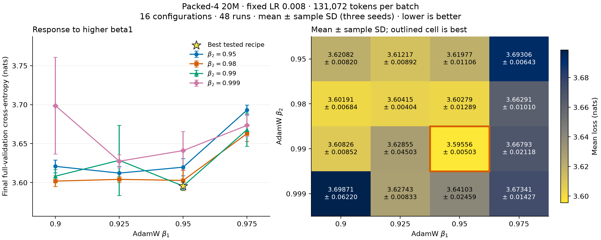
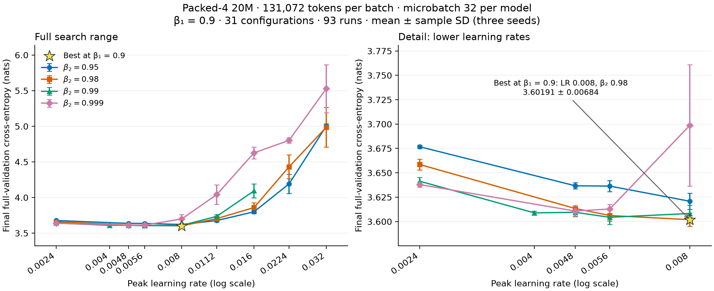

> **Historical report.** Settings and conclusions describe the recorded experiment. See the [current documentation](../results/overview.md) for maintained guidance.

# Packed-4 AWC 20M tuning at 128K tokens per batch

Measured on **2026-09-11–2026-09-12**: **129 successful runs** covering **43 distinct
LR/beta1/beta2 configurations**, each with runtime seeds **42, 43, and 44**.
The search covers learning rate and beta2 at beta1 0.9, and a complete
4×4 beta1/beta2 grid at LR 0.008.

The best tested recipe is [configs/packed4-20m-awc.yaml](../../configs/packed4-20m-awc.yaml):
**LR 0.008, beta1 0.95, beta2 0.99**, with mean final
full-validation loss **3.595559 ± 0.005025** nats. The preset
uses these settings. The runner-up, LR 0.008, beta1 0.9, beta2 0.98,
measured 3.601910 ± 0.006842; its mean is 0.006352 nats higher.

All runs use four local 20M models, `one_peer_exponential` topology, global
batch **131,072 prediction targets**, and microbatch **32 sequences per model**,
without accumulation. AWC computes and clips local gradients, mixes parameters,
then applies local AdamW updates. Optimizer moments remain local and adaptive
consensus is disabled. Validation evaluates the **globally averaged model**.
All ± values and error bars are **sample standard deviations across seeds**,
not confidence intervals.

## Results

Selection minimizes mean final-checkpoint full-validation cross-entropy across
all three seeds, breaking exact ties by lower LR, then beta1, then beta2.
All 43 configurations are ranked below and in the
[summary CSV](../data/recipe_sweep_packed4_20m_128k/summary.csv).

| Rank | LR | Beta1 | Beta2 | Mean loss (nats) | Sample SD |
|---|---:|---:|---:|---:|---:|
| 1 | 0.008 | 0.95 | 0.99 | 3.595559 | 0.005025 |
| 2 | 0.008 | 0.9 | 0.98 | 3.601910 | 0.006842 |
| 3 | 0.008 | 0.95 | 0.98 | 3.602794 | 0.012887 |
| 4 | 0.008 | 0.925 | 0.98 | 3.604153 | 0.004039 |
| 5 | 0.0056 | 0.9 | 0.99 | 3.604343 | 0.007428 |
| 6 | 0.0056 | 0.9 | 0.98 | 3.606178 | 0.005628 |
| 7 | 0.008 | 0.9 | 0.99 | 3.608260 | 0.008515 |
| 8 | 0.004 | 0.9 | 0.99 | 3.608885 | 0.001868 |
| 9 | 0.0048 | 0.9 | 0.99 | 3.609485 | 0.004022 |
| 10 | 0.0048 | 0.9 | 0.999 | 3.610736 | 0.005867 |
| 11 | 0.008 | 0.925 | 0.95 | 3.612169 | 0.008923 |
| 12 | 0.0056 | 0.9 | 0.999 | 3.612911 | 0.004840 |
| 13 | 0.0048 | 0.9 | 0.98 | 3.613361 | 0.000911 |
| 14 | 0.008 | 0.95 | 0.95 | 3.619770 | 0.011060 |
| 15 | 0.008 | 0.9 | 0.95 | 3.620824 | 0.008201 |
| 16 | 0.008 | 0.925 | 0.999 | 3.627433 | 0.008334 |
| 17 | 0.008 | 0.925 | 0.99 | 3.628551 | 0.045025 |
| 18 | 0.0056 | 0.9 | 0.95 | 3.636359 | 0.005782 |
| 19 | 0.0048 | 0.9 | 0.95 | 3.636687 | 0.003194 |
| 20 | 0.0024 | 0.9 | 0.999 | 3.637937 | 0.002463 |
| 21 | 0.008 | 0.95 | 0.999 | 3.641030 | 0.024592 |
| 22 | 0.0024 | 0.9 | 0.99 | 3.641324 | 0.004076 |
| 23 | 0.0024 | 0.9 | 0.98 | 3.658486 | 0.005469 |
| 24 | 0.008 | 0.975 | 0.98 | 3.662906 | 0.010097 |
| 25 | 0.008 | 0.975 | 0.99 | 3.667934 | 0.021182 |
| 26 | 0.008 | 0.975 | 0.999 | 3.673407 | 0.014273 |
| 27 | 0.0112 | 0.9 | 0.95 | 3.676571 | 0.019166 |
| 28 | 0.0024 | 0.9 | 0.95 | 3.676714 | 0.001646 |
| 29 | 0.008 | 0.975 | 0.95 | 3.693064 | 0.006425 |
| 30 | 0.008 | 0.9 | 0.999 | 3.698712 | 0.062199 |
| 31 | 0.0112 | 0.9 | 0.98 | 3.703557 | 0.036920 |
| 32 | 0.0112 | 0.9 | 0.99 | 3.735541 | 0.023741 |
| 33 | 0.016 | 0.9 | 0.95 | 3.798987 | 0.023771 |
| 34 | 0.016 | 0.9 | 0.98 | 3.858660 | 0.067922 |
| 35 | 0.0112 | 0.9 | 0.999 | 4.042032 | 0.138063 |
| 36 | 0.016 | 0.9 | 0.99 | 4.093433 | 0.096776 |
| 37 | 0.0224 | 0.9 | 0.95 | 4.191664 | 0.133312 |
| 38 | 0.0224 | 0.9 | 0.98 | 4.431065 | 0.167253 |
| 39 | 0.016 | 0.9 | 0.999 | 4.626482 | 0.083386 |
| 40 | 0.0224 | 0.9 | 0.999 | 4.801930 | 0.036562 |
| 41 | 0.032 | 0.9 | 0.98 | 4.985746 | 0.278777 |
| 42 | 0.032 | 0.9 | 0.95 | 5.001663 | 0.032599 |
| 43 | 0.032 | 0.9 | 0.999 | 5.528157 | 0.336108 |

The leading mean differences are small relative to seed variation. This ranking
does not establish statistical significance, equivalence, or global optimality.
Beta1 values above 0.9 were searched only at LR 0.008; the complete beta table
below is not a complete three-dimensional LR/beta1/beta2 search. These selections
use validation data and have no independent test estimate.

## Beta1/beta2 response at LR 0.008

All combinations of beta1 **0.9, 0.925, 0.95, 0.975** and beta2
**0.95, 0.98, 0.99, 0.999** have three measured seeds.



This figure covers **48 runs in all 16 configurations at LR 0.008**. Every cell
has three measured seeds; the star and outlined cell identify the best tested
recipe.
[PDF](../data/recipe_sweep_packed4_20m_128k/betas.pdf) · [PNG](../data/recipe_sweep_packed4_20m_128k/betas.png).

| Beta1 | Beta2 = 0.95 | Beta2 = 0.98 | Beta2 = 0.99 | Beta2 = 0.999 |
|---|---:|---:|---:|---:|
| 0.900 | 3.620824 ± 0.008201 | 3.601910 ± 0.006842 | 3.608260 ± 0.008515 | 3.698712 ± 0.062199 |
| 0.925 | 3.612169 ± 0.008923 | 3.604153 ± 0.004039 | 3.628551 ± 0.045025 | 3.627433 ± 0.008334 |
| 0.950 | 3.619770 ± 0.011060 | 3.602794 ± 0.012887 | 3.595559 ± 0.005025 | 3.641030 ± 0.024592 |
| 0.975 | 3.693064 ± 0.006425 | 3.662906 ± 0.010097 | 3.667934 ± 0.021182 | 3.673407 ± 0.014273 |

Beta2 0.99 gives the lowest mean at beta1 0.95. Beta2 0.98 gives the lowest mean
at beta1 0.9, 0.925, and 0.975. The beta1 0.925 / beta2 0.99 group has
substantial seed variation; all its finite outcomes remain in the dataset.

## Learning-rate response at beta1 0.9



These panels show **93 runs in 31 configurations at beta1 0.9**. Their marked
best setting is conditional on beta1 0.9, not the overall winner at beta1 0.95.
The left panel covers the full measured LR range; the right shows LRs up to
0.008 on a narrower loss scale. Beta2 0.99 was searched only up to LR 0.016.
Beta2 0.99 includes both LR 0.004 and 0.0048; the other beta2 values include
0.0048 but not 0.004. The LR/beta2 grid is therefore not rectangular; lines
connect measured points.
[PDF](../data/recipe_sweep_packed4_20m_128k/tuning.pdf) · [PNG](../data/recipe_sweep_packed4_20m_128k/tuning.png).

| Beta2 | Best LR at beta1 0.9 | Mean loss (nats) | Sample SD |
|---|---:|---:|---:|
| 0.95 | 0.008 | 3.620824 | 0.008201 |
| 0.98 | 0.008 | 3.601910 | 0.006842 |
| 0.99 | 0.0056 | 3.604343 | 0.007428 |
| 0.999 | 0.0048 | 3.610736 | 0.005867 |

The best tested LR at beta1 0.9 lies between 0.0048 and 0.008 for every beta2.
All four curves worsen above LR 0.008. Beta2 0.999 is especially sensitive to
higher LR: its mean rises from 3.610736 at LR 0.0048 to 4.626482 at LR 0.016.
At the smaller LRs, several configurations have closely spaced means relative
to seed variation.

The [beta2 0.99 analysis](recipe_sweep_packed4_awc_beta99_20m_128k.md) covers
all 30 AWC runs at that beta2, including LR response, beta1 sensitivity, and
matched ATC comparisons. Its best fixed-beta1-0.9 recipe, LR 0.0056 and beta2
0.99, is available as
[configs/packed4-20m-awc-beta99.yaml](../../configs/packed4-20m-awc-beta99.yaml).

## Comparison with ATC

The [ATC winner](recipe_sweep_packed4_atc_20m_128k.md), LR 0.0056, beta1
0.9, beta2 0.99, measured **3.595506 ± 0.003221**.
The selected AWC mean is **0.000053 nats higher**, far smaller than
the observed seed variation. These separately tuned recipes use different beta1
and LR values; the comparison does not isolate the mixing order or establish
equivalence. The ATC report includes all 21 matched comparisons at beta1 0.9.

The [synchronous 128K-token winner](recipe_sweep_20m_128k.md) measured
3.558689 ± 0.004887, 0.036870 nats below the AWC winner.
This comparison also changes local optimizer states and averaged-model evaluation.

## Search coverage and shared protocol

| Search slice | Learning rates | Beta1 | Beta2 | Configurations | Runs |
|---|---|---|---|---:|---:|
| LR response | 0.0024, 0.0048, 0.0056, 0.008, 0.0112, 0.016, 0.0224, 0.032 | 0.9 | 0.95, 0.98, 0.999 | 24 | 72 |
| LR response at beta2 0.99 | 0.0024, 0.004, 0.0048, 0.0056, 0.008, 0.0112, 0.016 | 0.9 | 0.99 | 7 | 21 |
| Beta1/beta2 response | 0.008 | 0.9, 0.925, 0.95, 0.975 | 0.95, 0.98, 0.99, 0.999 | 16 | 48 |

The LR and beta response slices overlap: 12 runs at LR 0.008 and beta1 0.9
appear in both figures, while the complete dataset contains 129 unique runs. All use identical frozen training
sources and dependency metadata, matching runtime versions, cache identity,
and budgets. Preprocessing seed 42 and validation seed 12345 remain fixed;
runtime seeds vary initialization and sample order. Nondeterministic execution
does not promise bitwise replay.

| Setting | Shared value |
|---|---|
| Models / architecture | 4 × 20,403,520 parameters; each 8 layers, width 320, 5 heads, FFN 896, vocabulary 32,000 |
| Context / local microbatch | 1,024 tokens / 32 sequences |
| Global batch | 4 × 32 × 1,024 = 131,072 targets; no accumulation |
| Global / per-model budget | 408,068,096 / 102,017,024 targets |
| Epochs / updates | 40 / 3,119, including shortened epoch-ending steps |
| Other local AdamW settings | Epsilon 1e-8, weight decay 0.1, per-model clipping 1.0 |
| Schedule | 5% token-based linear warmup, cosine decay to 10% of peak LR |
| Epoch / final validation | Fixed 1,024-block subset / full C4 split with 197,411,295 targets |
| Execution | GH200 120GB, BF16 autocast, FP32 weights, compiled SDPA, fused AdamW, 8 CPU threads |
| Retention | One final packed checkpoint per run |

Each allocation simulates all four workers on one GPU; physical inter-node
communication costs are not represented. Jobs used isolated compiler caches,
a 30-minute allocation limit, and at most 24 concurrent GPUs.

## Audit, artifacts, and reproduction

All **129 Slurm jobs completed with exit code 0**. The audit verified resolved
recipes, frozen source hashes, runtime versions, training and validation counts,
step and epoch counts, finite losses, and final-checkpoint presence. Every mean
and sample SD was recomputed from the 129 individual records, with all 43 groups
containing exactly seeds 42, 43, and 44. The fixed-LR beta table contains all
16 combinations.

All AWC runs use the same frozen training implementation and dependency metadata.
The source predates the scheme option and always executes AWC; the current
implementation defaults to the same order. Artifact locations, job IDs, source
origins, input hashes, and accounting are recorded per run in the data files.

- [Per-run CSV](../data/recipe_sweep_packed4_20m_128k/runs.csv): all 129 seeded records and artifact locations.
- [Summary CSV](../data/recipe_sweep_packed4_20m_128k/summary.csv): all 43 ranked configurations.
- [Results and provenance](../data/recipe_sweep_packed4_20m_128k/results.json): full metrics, source metadata, input hashes, and accounting.
- [Plot script](../data/recipe_sweep_packed4_20m_128k/plot.py): regenerates both PDF/PNG figure pairs from the summary CSV.

With the cache prepared as described in the [README](../guides/training.md#training),
reproduce the overall winner:

```bash
uv run tiny-llm train --config configs/packed4-20m-awc.yaml
```

Repeat with `--set runtime.seed=43` and `44` in separate output directories.
Override LR and betas to reproduce other configurations. Regenerate figures:

```bash
uv run python doc/data/recipe_sweep_packed4_20m_128k/plot.py
```
