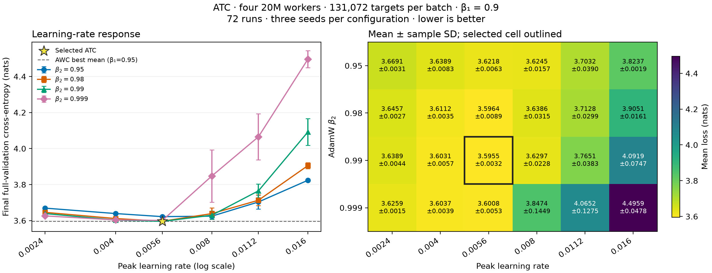

> **Historical report.** Settings and conclusions describe the recorded experiment. See the [current documentation](../results/overview.md) for maintained guidance.

# ATC packed-4 20M tuning at 128K tokens per batch

Measured on **2026-09-11**: **72 successful runs** covering **24 LR/beta2
configurations**, each with runtime seeds **42, 43, and 44**. Beta1 is fixed at 0.9.

The best tested ATC recipe is [configs/packed4-20m-atc.yaml](../../configs/packed4-20m-atc.yaml):
**LR 0.0056, beta2 0.99**, with mean final full-validation loss
**3.595506 ± 0.003221** nats. Values after ± and error bars are
**sample standard deviations across seeds**, not confidence intervals.

The search is a complete grid of six learning rates from **0.0024 to 0.016**
and beta2 **0.95, 0.98, 0.99, 0.999**. ATC computes and clips local gradients,
applies the complete local AdamW update, including weight decay, then mixes
parameters. Optimizer moments remain local. Adaptive consensus is disabled.

## Results



[PDF](../data/recipe_sweep_packed4_atc_20m_128k/tuning.pdf) ·
[PNG](../data/recipe_sweep_packed4_atc_20m_128k/tuning.png).

Selection minimizes mean final-checkpoint full-validation cross-entropy across
all three seeds, breaking exact ties by lower LR, then beta2. All finite outcomes
are retained. The winner is inside both tested parameter ranges.
The small seed count and validation-based selection limit conclusions about statistical significance and global optimality; there
is no independent test estimate.

| Rank | LR | Beta2 | Mean loss (nats) | Sample SD |
|---|---:|---:|---:|---:|
| 1 | 0.0056 | 0.99 | 3.595506 | 0.003221 |
| 2 | 0.0056 | 0.98 | 3.596440 | 0.008910 |
| 3 | 0.0056 | 0.999 | 3.600831 | 0.005306 |
| 4 | 0.004 | 0.99 | 3.603139 | 0.005687 |
| 5 | 0.004 | 0.999 | 3.603680 | 0.003883 |
| 6 | 0.004 | 0.98 | 3.611185 | 0.003510 |
| 7 | 0.0056 | 0.95 | 3.621841 | 0.006250 |
| 8 | 0.008 | 0.95 | 3.624492 | 0.015674 |
| 9 | 0.0024 | 0.999 | 3.625898 | 0.001529 |
| 10 | 0.008 | 0.99 | 3.629706 | 0.022798 |
| 11 | 0.008 | 0.98 | 3.638587 | 0.031525 |
| 12 | 0.004 | 0.95 | 3.638892 | 0.008257 |
| 13 | 0.0024 | 0.99 | 3.638942 | 0.004437 |
| 14 | 0.0024 | 0.98 | 3.645663 | 0.002732 |
| 15 | 0.0024 | 0.95 | 3.669129 | 0.003097 |
| 16 | 0.0112 | 0.95 | 3.703247 | 0.039032 |
| 17 | 0.0112 | 0.98 | 3.712830 | 0.029933 |
| 18 | 0.0112 | 0.99 | 3.765067 | 0.038261 |
| 19 | 0.016 | 0.95 | 3.823709 | 0.001921 |
| 20 | 0.008 | 0.999 | 3.847420 | 0.144914 |
| 21 | 0.016 | 0.98 | 3.905099 | 0.016081 |
| 22 | 0.0112 | 0.999 | 4.065187 | 0.127460 |
| 23 | 0.016 | 0.99 | 4.091881 | 0.074687 |
| 24 | 0.016 | 0.999 | 4.495882 | 0.047780 |

At LR 0.0056, beta2 0.99 leads beta2 0.98 by only 0.000934 nats, smaller than
the observed seed variation. Beta2 0.999 ranks third at the same LR and worsens
sharply at LR 0.008 and above. These results favor the lower LR region for ATC,
while providing limited evidence to distinguish the top beta2 choices.

## Comparison with AWC

The best tested AWC recipe, LR 0.008, beta1 0.95, and beta2 0.99, measured
3.595559 ± 0.005025. The selected ATC mean is
**0.000053 nats lower**. These are separately selected validation
results using different beta1 and LR values, not an independent test comparison
or proof of an algorithmic advantage. The mean difference is far smaller than
the observed seed variation.

The following 21 comparisons use matching LR, beta1, beta2, and runtime seeds.
All overlapping configurations from the [complete AWC dataset](recipe_sweep_packed4_20m_128k.md)
are included; beta1 is 0.9 in every matched comparison.
Negative differences favor ATC. All shared model, batch, budget, evaluation, and
cache settings were audited against the AWC results. Nondeterministic execution
does not promise bitwise replay.

| LR | Beta2 | ATC mean | AWC mean | ATC − AWC |
|---|---:|---:|---:|---:|
| 0.0024 | 0.95 | 3.669129 | 3.676714 | -0.007585 |
| 0.0024 | 0.98 | 3.645663 | 3.658486 | -0.012823 |
| 0.0024 | 0.99 | 3.638942 | 3.641324 | -0.002382 |
| 0.0024 | 0.999 | 3.625898 | 3.637937 | -0.012039 |
| 0.004 | 0.99 | 3.603139 | 3.608885 | -0.005745 |
| 0.0056 | 0.95 | 3.621841 | 3.636359 | -0.014518 |
| 0.0056 | 0.98 | 3.596440 | 3.606178 | -0.009738 |
| 0.0056 | 0.99 | 3.595506 | 3.604343 | -0.008837 |
| 0.0056 | 0.999 | 3.600831 | 3.612911 | -0.012080 |
| 0.008 | 0.95 | 3.624492 | 3.620824 | +0.003668 |
| 0.008 | 0.98 | 3.638587 | 3.601910 | +0.036677 |
| 0.008 | 0.99 | 3.629706 | 3.608260 | +0.021446 |
| 0.008 | 0.999 | 3.847420 | 3.698712 | +0.148707 |
| 0.0112 | 0.95 | 3.703247 | 3.676571 | +0.026676 |
| 0.0112 | 0.98 | 3.712830 | 3.703557 | +0.009273 |
| 0.0112 | 0.99 | 3.765067 | 3.735541 | +0.029526 |
| 0.0112 | 0.999 | 4.065187 | 4.042032 | +0.023155 |
| 0.016 | 0.95 | 3.823709 | 3.798987 | +0.024722 |
| 0.016 | 0.98 | 3.905099 | 3.858660 | +0.046438 |
| 0.016 | 0.99 | 4.091881 | 4.093433 | -0.001552 |
| 0.016 | 0.999 | 4.495882 | 4.626482 | -0.130600 |

## Protocol

| Setting | Value |
|---|---|
| Learning rate | 0.0024, 0.004, 0.0056, 0.008, 0.0112, 0.016 |
| AdamW beta2 / beta1 | 0.95, 0.98, 0.99, 0.999 / 0.9 |
| Runtime seeds | 42, 43, 44 |
| Workers / topology | Four 20,403,520-parameter models / one_peer_exponential |
| Global batch / local microbatch | 131,072 targets / 32 sequences per worker |
| Context length | 1,024 |
| Training budget | 408,068,096 global targets; 102,017,024 per worker |
| Epochs / updates | 40 / 3,119, including shortened epoch-ending steps |
| Other optimizer settings | Weight decay 0.1, epsilon 1e-8, local clipping 1.0 |
| LR schedule | 5% linear warmup, cosine decay to 10% of peak LR |
| Epoch evaluation | Globally averaged model, fixed 1,024-block subset |
| Final evaluation | Globally averaged model, full C4 split: 197,411,295 targets |
| Execution | GH200 120GB, BF16 autocast, FP32 weights, compiled SDPA, fused AdamW |
| Retention | One final packed training checkpoint per run |

The data preprocessing seed remains 42 and validation seed remains 12345;
runtime seeds vary initialization and sample order. Each job simulates all four
workers on one GPU. Physical inter-node communication costs are not measured.

## Audit and reproduction

All **72 Slurm jobs completed with exit code 0**. The audit verified the exact
resolved recipe, ATC metadata, model sizes, training/validation counts, step and
epoch counts, final-checkpoint presence, frozen source hashes, and common runtime
versions. The dataset has 72 unique seeded recipes and 24 complete three-seed
groups. The runtime source digest matches the frozen inputs for every run.

All ATC runs use identical frozen training sources. Compared with the AWC
source, only configuration, training, and packed-benchmark files changed for the
scheme option. Resolved configurations, dependency metadata, source patches,
artifact locations, job IDs, and SHA-256 hashes are retained in the results JSON.
Jobs used isolated compiler caches, up to 24 concurrent GPUs, and a 30-minute
allocation limit.

- [Per-run CSV](../data/recipe_sweep_packed4_atc_20m_128k/runs.csv): losses, seeds, job IDs, and artifact locations.
- [Summary CSV](../data/recipe_sweep_packed4_atc_20m_128k/summary.csv): all 24 configurations ranked by mean loss.
- [Results and provenance](../data/recipe_sweep_packed4_atc_20m_128k/results.json): full metrics, hashes, and AWC comparisons.
- [Slurm accounting](../data/recipe_sweep_packed4_atc_20m_128k/slurm-accounting.txt).
- [Plot script](../data/recipe_sweep_packed4_atc_20m_128k/plot.py).

Reproduce the selected ATC configuration with the prepared cache:

```bash
uv run tiny-llm train --config configs/packed4-20m-atc.yaml
```

Repeat with `--set runtime.seed=43` and `44` in separate output directories.
To reproduce other grid points, override `optimizer.lr` and `optimizer.beta2`.
`configs/packed4-20m-awc.yaml` selects the best tested AWC recipe. Regenerate figures:

```bash
uv run python doc/data/recipe_sweep_packed4_atc_20m_128k/plot.py
```
