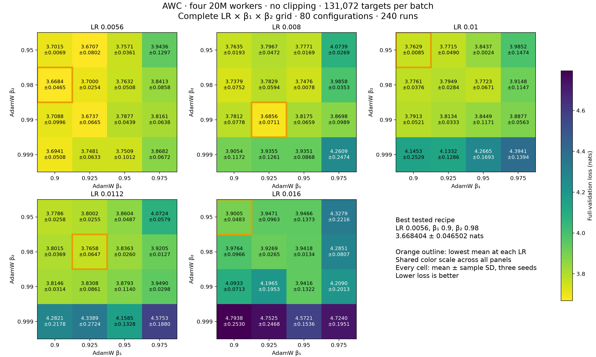
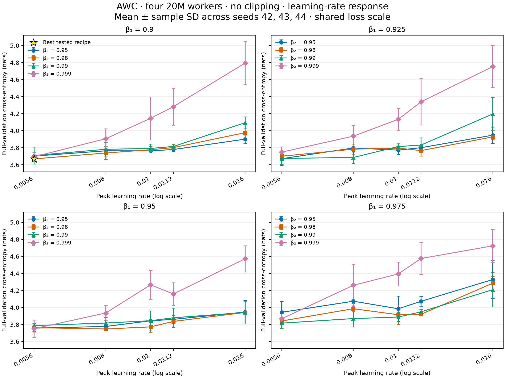
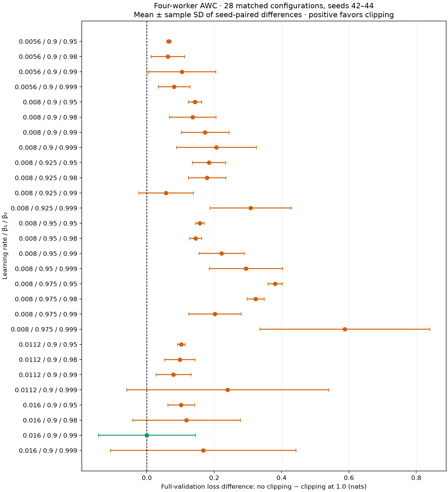

> **Historical report.** Settings and conclusions describe the recorded experiment. See the [current documentation](../results/overview.md) for maintained guidance.

# Four-worker AWC without gradient clipping: 20M tuning at 128K tokens

Measured on **2026-09-12–2026-09-13**: **240 successful runs** covering a complete
**80-configuration LR/beta1/beta2 grid**, with runtime seeds **42, 43, and 44**
for every configuration. This report describes AWC with gradient clipping disabled
and compares it with the [four-worker clipped AWC study](recipe_sweep_packed4_20m_128k.md).

**Clipping at norm 1.0 is favored within the tested settings.** Removing clipping
increases mean final full-validation loss in **27 of the 28 matched configurations**.
The best tested no-clipping recipe is **LR 0.0056, beta1 0.9,
beta2 0.98**, with loss **3.668404 ± 0.046502** nats.
The tuned clipped recipe measures **3.595559 ± 0.005025**,
0.072846 nats lower. These selected recipes use different
hyperparameters; the matched comparisons below hold LR and betas fixed.

All ± values are **sample standard deviations across three seeds**, not confidence
intervals. In the difference column and comparison plot, the SD is computed from
the three seed-paired differences. Lower loss is better.

## Variant and search space

AWC first computes local forward and backward passes, then mixes parameters,
then applies local AdamW updates. With clipping enabled, each worker's gradients
are clipped to norm 1.0 before mixing. Here `optimizer.grad_clip=null` skips that
scaling operation. Gradient norms are still computed and logged, and nonfinite
gradients still stop training. Optimizer moments remain local; adaptive consensus
is disabled. Both variants evaluate the globally averaged model.

| Parameter | Values |
|---|---|
| Learning rate | 0.0056, 0.008, 0.010, 0.0112, 0.016 |
| AdamW beta1 | 0.9, 0.925, 0.95, 0.975 |
| AdamW beta2 | 0.95, 0.98, 0.99, 0.999 |
| Runtime seeds | 42, 43, 44 |
| Gradient clipping | Disabled (`optimizer.grad_clip=null`) |

Every unique combination has three runs: 5 × 4 × 4 × 3 = 240. All completed with
finite full-validation losses; no failed or divergent jobs were discarded.
Selection minimizes mean final full-validation cross-entropy over all three seeds,
breaking exact ties by lower LR, then beta1, then beta2.

## No-clipping response surfaces



[PDF](../data/recipe_sweep_packed4_awc_noclip_20m_128k/heatmaps.pdf) ·
[PNG](../data/recipe_sweep_packed4_awc_noclip_20m_128k/heatmaps.png).
Each panel covers 16 configurations and 48 runs, with a shared color scale.
Cells show mean ± sample SD; orange outlines mark the best mean within each LR.

| LR | Best beta1 | Best beta2 | Mean loss ± sample SD |
|---|---:|---:|---:|
| 0.0056 | 0.9 | 0.98 | 3.668404 ± 0.046502 |
| 0.008 | 0.925 | 0.99 | 3.685574 ± 0.071087 |
| 0.01 | 0.9 | 0.95 | 3.762922 ± 0.008466 |
| 0.0112 | 0.925 | 0.98 | 3.765837 ± 0.064662 |
| 0.016 | 0.9 | 0.95 | 3.900531 ± 0.048257 |

The best mean at each LR worsens as LR increases across this grid. The overall
winner lies at the **lowest tested LR and lowest tested beta1**, so this sweep
does not rule out better unclipped settings below those bounds. The next-best
configuration is only 0.002288 nats behind, compared with
substantial seed variation in both groups. The top-ranked hyperparameters should
therefore be interpreted as the best tested mean, not a precisely resolved optimum.



[PDF](../data/recipe_sweep_packed4_awc_noclip_20m_128k/tuning.pdf) ·
[PNG](../data/recipe_sweep_packed4_awc_noclip_20m_128k/tuning.png).
Each panel fixes beta1 and includes four beta2 curves; error bars show sample SD.
All panels share the same loss scale, and lines connect measured points.

## Comparison with clipping enabled

### Selected recipes and fixed-hyperparameter checks

| Comparison | No clipping | Clipping at 1.0 | No clipping − clipping |
|---|---:|---:|---:|
| Each variant's best tested recipe | 3.668404 ± 0.046502 | 3.595559 ± 0.005025 | +0.072846 |
| Fixed LR 0.0056, beta1 0.9, beta2 0.98 | 3.668404 ± 0.046502 | 3.606178 ± 0.005628 | +0.062226 |
| Fixed LR 0.008, beta1 0.95, beta2 0.99 | 3.817465 ± 0.065895 | 3.595559 ± 0.005025 | +0.221906 |

The clipped winner uses LR 0.008, beta1 0.95, beta2 0.99.
Clipping improves the measured mean at both variants' selected settings. The
selected-recipe comparison covers unequal search spaces: 80 configurations without
clipping and 43 with clipping. It does not isolate the effect of clipping by itself.

### All matched configurations

There are **28 shared configurations and 84 pairs of seeded runs**. Both variants
match LR, beta1, beta2, runtime seeds, local worker count, architecture, global and
local batch sizes, token budget, topology, optimizer settings, data cache, and
validation protocol. This overlap consists of all 16 beta pairs at LR 0.008,
plus the four beta2 choices at beta1 0.9 for LR 0.0056, 0.0112, and 0.016.



[PDF](../data/recipe_sweep_packed4_awc_noclip_20m_128k/comparison.pdf) ·
[PNG](../data/recipe_sweep_packed4_awc_noclip_20m_128k/comparison.png).
Positive differences favor clipping. Error bars show sample SD of the three
seed-paired differences, not uncertainty bounds on the mean.

The median difference across the 28 configuration means is
**+0.151066 nats**.
Clipping has the lower mean in 27 configurations. The only negative difference,
at LR 0.016, beta1 0.9, beta2 0.99, is
**-0.000140 ± 0.144131**,
which is negligible relative to its seed variation.

Across the matched configurations, median within-configuration sample SD is
**0.062629 without clipping**, versus
**0.011973 with clipping**. This describes
greater sensitivity to runtime seed without clipping in this experiment; all
240 unclipped jobs nevertheless completed with finite results. The median
difference and win count describe this particular grid and are not an average
effect over arbitrary training recipes.

| LR | Beta1 | Beta2 | No clipping mean ± SD | Clipped mean ± SD | Paired difference mean ± SD |
|---|---:|---:|---:|---:|---:|
| 0.0056 | 0.9 | 0.95 | 3.701510 ± 0.006856 | 3.636359 ± 0.005782 | +0.065151 ± 0.006410 |
| 0.0056 | 0.9 | 0.98 | 3.668404 ± 0.046502 | 3.606178 ± 0.005628 | +0.062226 ± 0.050169 |
| 0.0056 | 0.9 | 0.99 | 3.708780 ± 0.099574 | 3.604343 ± 0.007428 | +0.104437 ± 0.100368 |
| 0.0056 | 0.9 | 0.999 | 3.694059 ± 0.050843 | 3.612911 ± 0.004840 | +0.081148 ± 0.046814 |
| 0.008 | 0.9 | 0.95 | 3.763544 ± 0.019251 | 3.620824 ± 0.008201 | +0.142719 ± 0.020251 |
| 0.008 | 0.9 | 0.98 | 3.737945 ± 0.075153 | 3.601910 ± 0.006842 | +0.136035 ± 0.068930 |
| 0.008 | 0.9 | 0.99 | 3.781161 ± 0.077809 | 3.608260 ± 0.008515 | +0.172901 ± 0.070660 |
| 0.008 | 0.9 | 0.999 | 3.905399 ± 0.117183 | 3.698712 ± 0.062199 | +0.206686 ± 0.118346 |
| 0.008 | 0.925 | 0.95 | 3.796693 ± 0.047171 | 3.612169 ± 0.008923 | +0.184523 ± 0.049492 |
| 0.008 | 0.925 | 0.98 | 3.782922 ± 0.059363 | 3.604153 ± 0.004039 | +0.178768 ± 0.055513 |
| 0.008 | 0.925 | 0.99 | 3.685574 ± 0.071087 | 3.628551 ± 0.045025 | +0.057023 ± 0.081163 |
| 0.008 | 0.925 | 0.999 | 3.935499 ± 0.126134 | 3.627433 ± 0.008334 | +0.308067 ± 0.120851 |
| 0.008 | 0.95 | 0.95 | 3.777113 ± 0.016950 | 3.619770 ± 0.011060 | +0.157343 ± 0.012935 |
| 0.008 | 0.95 | 0.98 | 3.747583 ± 0.007761 | 3.602794 ± 0.012887 | +0.144789 ± 0.018196 |
| 0.008 | 0.95 | 0.99 | 3.817465 ± 0.065895 | 3.595559 ± 0.005025 | +0.221906 ± 0.067133 |
| 0.008 | 0.95 | 0.999 | 3.935121 ± 0.086816 | 3.641030 ± 0.024592 | +0.294090 ± 0.108547 |
| 0.008 | 0.975 | 0.95 | 4.073854 ± 0.026903 | 3.693064 ± 0.006425 | +0.380790 ± 0.021325 |
| 0.008 | 0.975 | 0.98 | 3.985828 ± 0.035332 | 3.662906 ± 0.010097 | +0.322922 ± 0.025325 |
| 0.008 | 0.975 | 0.99 | 3.869753 ± 0.098904 | 3.667934 ± 0.021182 | +0.201819 ± 0.077723 |
| 0.008 | 0.975 | 0.999 | 4.260894 ± 0.247420 | 3.673407 ± 0.014273 | +0.587487 ± 0.252082 |
| 0.0112 | 0.9 | 0.95 | 3.778609 ± 0.025774 | 3.676571 ± 0.019166 | +0.102038 ± 0.011421 |
| 0.0112 | 0.9 | 0.98 | 3.801480 ± 0.036901 | 3.703557 ± 0.036920 | +0.097923 ± 0.044876 |
| 0.0112 | 0.9 | 0.99 | 3.814564 ± 0.031403 | 3.735541 ± 0.023741 | +0.079023 ± 0.052127 |
| 0.0112 | 0.9 | 0.999 | 4.282084 ± 0.217791 | 4.042032 ± 0.138063 | +0.240052 ± 0.300522 |
| 0.016 | 0.9 | 0.95 | 3.900531 ± 0.048257 | 3.798987 ± 0.023771 | +0.101545 ± 0.039625 |
| 0.016 | 0.9 | 0.98 | 3.976379 ± 0.096566 | 3.858660 ± 0.067922 | +0.117718 ± 0.159880 |
| 0.016 | 0.9 | 0.99 | 4.093293 ± 0.071337 | 4.093433 ± 0.096776 | -0.000140 ± 0.144131 |
| 0.016 | 0.9 | 0.999 | 4.793792 ± 0.253026 | 4.626482 ± 0.083386 | +0.167309 ± 0.275325 |

These results support retaining clipping for the measured four-worker protocol.
They do not establish that clipping is necessary at every LR or for every model.
Only three runtime seeds were tested; validation-based selection has no independent
test estimate. The unclipped winner is at a search boundary, and 52 of its
configurations have no clipped counterpart. Both implementations use the same AWC
order, but source revisions differ to support the scheme and no-clipping options.
Checkpoint retention also differs (none versus final). Matching seeds does not
guarantee bitwise-identical execution or remove these provenance differences.

## Complete no-clipping ranking

All 80 configurations are ranked below and in the
[summary CSV](../data/recipe_sweep_packed4_awc_noclip_20m_128k/summary.csv).

| Rank | LR | Beta1 | Beta2 | Mean loss (nats) | Sample SD |
|---|---:|---:|---:|---:|---:|
| 1 | 0.0056 | 0.9 | 0.98 | 3.668404 | 0.046502 |
| 2 | 0.0056 | 0.925 | 0.95 | 3.670693 | 0.080207 |
| 3 | 0.0056 | 0.925 | 0.99 | 3.673659 | 0.066504 |
| 4 | 0.008 | 0.925 | 0.99 | 3.685574 | 0.071087 |
| 5 | 0.0056 | 0.9 | 0.999 | 3.694059 | 0.050843 |
| 6 | 0.0056 | 0.925 | 0.98 | 3.699950 | 0.025368 |
| 7 | 0.0056 | 0.9 | 0.95 | 3.701510 | 0.006856 |
| 8 | 0.0056 | 0.9 | 0.99 | 3.708780 | 0.099574 |
| 9 | 0.008 | 0.9 | 0.98 | 3.737945 | 0.075153 |
| 10 | 0.008 | 0.95 | 0.98 | 3.747583 | 0.007761 |
| 11 | 0.0056 | 0.925 | 0.999 | 3.748107 | 0.063325 |
| 12 | 0.0056 | 0.95 | 0.999 | 3.750929 | 0.101220 |
| 13 | 0.0056 | 0.95 | 0.95 | 3.757142 | 0.036115 |
| 14 | 0.01 | 0.9 | 0.95 | 3.762922 | 0.008466 |
| 15 | 0.0056 | 0.95 | 0.98 | 3.763249 | 0.050827 |
| 16 | 0.008 | 0.9 | 0.95 | 3.763544 | 0.019251 |
| 17 | 0.0112 | 0.925 | 0.98 | 3.765837 | 0.064662 |
| 18 | 0.01 | 0.925 | 0.95 | 3.771465 | 0.048977 |
| 19 | 0.01 | 0.95 | 0.98 | 3.772336 | 0.067123 |
| 20 | 0.01 | 0.9 | 0.98 | 3.776088 | 0.037597 |
| 21 | 0.008 | 0.95 | 0.95 | 3.777113 | 0.016950 |
| 22 | 0.0112 | 0.9 | 0.95 | 3.778609 | 0.025774 |
| 23 | 0.008 | 0.9 | 0.99 | 3.781161 | 0.077809 |
| 24 | 0.008 | 0.925 | 0.98 | 3.782922 | 0.059363 |
| 25 | 0.0056 | 0.95 | 0.99 | 3.787666 | 0.043892 |
| 26 | 0.01 | 0.9 | 0.99 | 3.791334 | 0.052137 |
| 27 | 0.01 | 0.925 | 0.98 | 3.794904 | 0.028355 |
| 28 | 0.008 | 0.925 | 0.95 | 3.796693 | 0.047171 |
| 29 | 0.0112 | 0.925 | 0.95 | 3.800214 | 0.025526 |
| 30 | 0.0112 | 0.9 | 0.98 | 3.801480 | 0.036901 |
| 31 | 0.01 | 0.925 | 0.99 | 3.813384 | 0.033281 |
| 32 | 0.0112 | 0.9 | 0.99 | 3.814564 | 0.031403 |
| 33 | 0.0056 | 0.975 | 0.99 | 3.816111 | 0.063759 |
| 34 | 0.008 | 0.95 | 0.99 | 3.817465 | 0.065895 |
| 35 | 0.0112 | 0.925 | 0.99 | 3.830785 | 0.086128 |
| 36 | 0.0112 | 0.95 | 0.98 | 3.836347 | 0.026007 |
| 37 | 0.0056 | 0.975 | 0.98 | 3.841288 | 0.085760 |
| 38 | 0.01 | 0.95 | 0.95 | 3.843661 | 0.002419 |
| 39 | 0.01 | 0.95 | 0.99 | 3.844877 | 0.117091 |
| 40 | 0.0112 | 0.95 | 0.95 | 3.860438 | 0.048700 |
| 41 | 0.0056 | 0.975 | 0.999 | 3.868248 | 0.067176 |
| 42 | 0.008 | 0.975 | 0.99 | 3.869753 | 0.098904 |
| 43 | 0.0112 | 0.95 | 0.99 | 3.879319 | 0.114015 |
| 44 | 0.01 | 0.975 | 0.99 | 3.887709 | 0.056319 |
| 45 | 0.016 | 0.9 | 0.95 | 3.900531 | 0.048257 |
| 46 | 0.008 | 0.9 | 0.999 | 3.905399 | 0.117183 |
| 47 | 0.01 | 0.975 | 0.98 | 3.914777 | 0.114692 |
| 48 | 0.0112 | 0.975 | 0.98 | 3.920527 | 0.012665 |
| 49 | 0.016 | 0.925 | 0.98 | 3.926926 | 0.026457 |
| 50 | 0.008 | 0.95 | 0.999 | 3.935121 | 0.086816 |
| 51 | 0.008 | 0.925 | 0.999 | 3.935499 | 0.126134 |
| 52 | 0.016 | 0.95 | 0.99 | 3.941609 | 0.132243 |
| 53 | 0.016 | 0.95 | 0.98 | 3.941765 | 0.013379 |
| 54 | 0.0056 | 0.975 | 0.95 | 3.943637 | 0.129667 |
| 55 | 0.016 | 0.95 | 0.95 | 3.946647 | 0.137261 |
| 56 | 0.016 | 0.925 | 0.95 | 3.947067 | 0.096284 |
| 57 | 0.0112 | 0.975 | 0.99 | 3.949028 | 0.029781 |
| 58 | 0.016 | 0.9 | 0.98 | 3.976379 | 0.096566 |
| 59 | 0.01 | 0.975 | 0.95 | 3.985236 | 0.147432 |
| 60 | 0.008 | 0.975 | 0.98 | 3.985828 | 0.035332 |
| 61 | 0.0112 | 0.975 | 0.95 | 4.072419 | 0.057884 |
| 62 | 0.008 | 0.975 | 0.95 | 4.073854 | 0.026903 |
| 63 | 0.016 | 0.9 | 0.99 | 4.093293 | 0.071337 |
| 64 | 0.01 | 0.925 | 0.999 | 4.133170 | 0.128570 |
| 65 | 0.01 | 0.9 | 0.999 | 4.145337 | 0.252933 |
| 66 | 0.0112 | 0.95 | 0.999 | 4.158460 | 0.132825 |
| 67 | 0.016 | 0.925 | 0.99 | 4.196485 | 0.195330 |
| 68 | 0.016 | 0.975 | 0.99 | 4.209019 | 0.201328 |
| 69 | 0.008 | 0.975 | 0.999 | 4.260894 | 0.247420 |
| 70 | 0.01 | 0.95 | 0.999 | 4.266542 | 0.169319 |
| 71 | 0.0112 | 0.9 | 0.999 | 4.282084 | 0.217791 |
| 72 | 0.016 | 0.975 | 0.98 | 4.285081 | 0.080717 |
| 73 | 0.016 | 0.975 | 0.95 | 4.327913 | 0.221607 |
| 74 | 0.0112 | 0.925 | 0.999 | 4.338886 | 0.272380 |
| 75 | 0.01 | 0.975 | 0.999 | 4.394080 | 0.139400 |
| 76 | 0.016 | 0.95 | 0.999 | 4.572089 | 0.153622 |
| 77 | 0.0112 | 0.975 | 0.999 | 4.575316 | 0.188011 |
| 78 | 0.016 | 0.975 | 0.999 | 4.724002 | 0.195091 |
| 79 | 0.016 | 0.925 | 0.999 | 4.752523 | 0.246805 |
| 80 | 0.016 | 0.9 | 0.999 | 4.793792 | 0.253026 |

The selected no-clipping recipe's individual full-validation losses are:

| Runtime seed | Loss (nats) |
|---|---:|
| 42 | 3.689980033 |
| 43 | 3.615033275 |
| 44 | 3.700199450 |

## Shared training protocol

| Setting | Value |
|---|---|
| Local models | 4 × 20,403,520 parameters; 81,614,080 total local parameters |
| Architecture per model | 8 layers, width 320, 5 heads, FFN 896, vocabulary 32,000 |
| Topology / scheme | one_peer_exponential / AWC |
| Context / local microbatch | 1,024 tokens / 32 sequences |
| Global batch | 4 × 32 × 1,024 = 131,072 targets; no accumulation |
| Global / per-model training budget | 408,068,096 / 102,017,024 targets |
| Epochs / updates | 40 / 3,119, including shortened epoch-ending steps |
| Other AdamW settings | Weight decay 0.1, epsilon 1e-8 |
| Schedule | 5% token-based linear warmup; cosine decay to 10% of peak LR |
| Epoch evaluation | Fixed 1,024-block subset, globally averaged model |
| Final evaluation | Full C4 validation split: 197,411,295 targets, globally averaged model |
| Preprocessing / validation seeds | 42 / 12345 |
| Adaptive consensus | Disabled |
| Execution | GH200 120GB, BF16 autocast, FP32 weights, compiled SDPA, fused AdamW, 8 CPU threads |
| Runtime | Python 3.12.13, PyTorch 2.14.0, CUDA 13.0 |
| No-clipping checkpoint policy | none; no model, optimizer, or weight files saved |

Each job simulates four workers on one GPU, so these measurements do not include
physical inter-node communication costs. Median no-clipping run time including
validation was 429.5 seconds (range 395.5–480.2).
Jobs used at most 24 concurrent GPUs, isolated compiler caches, and a 30-minute
allocation limit. This report makes no speedup claim from removing clipping.

## Audit and data

All **240 tasks in Slurm array 2341796 completed with exit code 0**. The audit
verified frozen source and config hashes, resolved recipes, runtime source digests
and versions, training and validation counts, update and epoch counts, finite
losses, and absence of checkpoint files. Every group has exactly seeds 42, 43,
and 44; means and sample SDs are recomputed from per-run measurements.

For the clipped reference, all 84 matching individual losses are preserved in the
published [AWC results dataset](../data/recipe_sweep_packed4_20m_128k/results.json), and its
28 matched means and SDs were recomputed. **57 original result/config pairs were
re-audited**; after allowing for clipping, checkpoint retention, output path, and
the explicit default AWC field, the resolved configurations match. The original
archive for **27 clipped runs** at higher beta1 is unavailable, so those comparisons
use the published per-run records and protocol/source metadata. They cannot be
re-audited against the original resolved files in the current workspace. Each
paired row records which evidence was available; no results were imputed.

The no-clipping archive is `runs/packed4-awc-noclip-20m-batch128k-20260912`.
It contains the frozen source based on commit `11fb614`, the archived no-clipping
patch, all configurations, and run artifacts. Its source digest is
`6dca9dce4dd90a52bf05087a92b343825aeab6076e93675da7b6ce80674eda71`. The results JSON includes input and artifact hashes and
the SHA-256 of the clipped reference dataset.

- [Per-run CSV](../data/recipe_sweep_packed4_awc_noclip_20m_128k/runs.csv): all 240 no-clipping outcomes.
- [Summary CSV](../data/recipe_sweep_packed4_awc_noclip_20m_128k/summary.csv): all 80 ranked configurations.
- [Matched configuration CSV](../data/recipe_sweep_packed4_awc_noclip_20m_128k/matched_clipped.csv): all 28 comparisons.
- [Matched seed CSV](../data/recipe_sweep_packed4_awc_noclip_20m_128k/matched_runs.csv): all 84 paired outcomes and evidence sources.
- [Results and provenance](../data/recipe_sweep_packed4_awc_noclip_20m_128k/results.json).
- [Slurm accounting](../data/recipe_sweep_packed4_awc_noclip_20m_128k/slurm-accounting.txt).
- [Collection script](../data/recipe_sweep_packed4_awc_noclip_20m_128k/collect.py), [plot script](../data/recipe_sweep_packed4_awc_noclip_20m_128k/plot.py), and [report generator](../data/recipe_sweep_packed4_awc_noclip_20m_128k/write_report.py).

## Reproduction

With the prepared C4 cache, reproduce the best tested no-clipping recipe:

```bash
uv run tiny-llm train --config configs/packed4-20m-awc.yaml \
  --set optimizer.lr=0.0056 \
  --set optimizer.beta1=0.9 \
  --set optimizer.beta2=0.98 \
  --set optimizer.grad_clip=null \
  --set training.checkpoint_policy=none \
  --set runtime.output_dir=runs/packed4-20m-awc-noclip-seed42
```

Repeat with runtime seeds 43 and 44 in separate output directories. For a matched
clipped run, use `optimizer.grad_clip=1.0` at the same LR and betas. The existing
AWC winner preset is unchanged. Checkpoint-free runs retain metrics but cannot
be resumed or used for checkpoint analysis. Regenerate the figures and report:

```bash
uv run python doc/data/recipe_sweep_packed4_awc_noclip_20m_128k/plot.py
uv run python doc/data/recipe_sweep_packed4_awc_noclip_20m_128k/write_report.py
```
