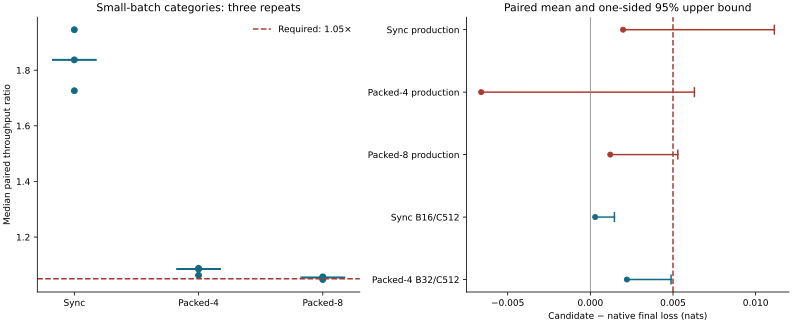

The GH200 backend is integrated for synchronous and decentralized training. Native retirement is blocked by the frozen acceptance gates. Following this qualification, GH200 became the default at the user's request; native remains explicitly selectable. This default change does not alter the measurements or acceptance thresholds below.

[Performance pairs CSV](gh200/performance.csv) · [Numerical cases CSV](gh200/numerical.csv) · [Convergence CSV](gh200/convergence.csv) · [Validation curves CSV](gh200/validation-curves.csv) · [Gate results](gh200/qualification.json) · [Provenance](gh200/provenance.json)

## Frozen protocol

The fresh native campaign completed before backend implementation: 351 throughput measurements, 117 native/native numerical controls, and 15 full-budget training runs. The user's modified packed-8 recipe was included in the executable snapshot. Both convergence campaigns use seeds 45–47, approximately 408M training targets per run, and the full 197,411,295-target validation split.

Throughput pairs run in the same GH200 allocation with alternating order and equal update counts. Each side executes at least 20 warmup updates and five windows of at least one second. Measurements include the production loader, transfers, schedules, clipping, consensus and logging. Every workload has three independent allocations. Startup, timed training, elapsed time, allocated memory and reserved memory are separate CSV columns.

Startup includes runner setup, compilation/capture and warmup. Timed training is the sum of the five scored windows; elapsed time additionally includes setup and result collection. Interpreter imports and scheduler queue time are outside these timers. These boundaries are identical for both sides of a pair.

For every small-batch category, each repeat's median candidate/native ratio across workloads must be at least 1.05. Every required production case must remain at or above 0.98 in all three repeats. The matrix covers 20M/50M/90M, synchronous/packed-4/packed-8, local batches 4/8/16, contexts 512/1024, clipping 1/off, production recipes, accumulation remainders, ATC and adaptive consensus.

## Performance

| Category | Repeat 1 | Repeat 2 | Repeat 3 | Gate |
| --- | ---: | ---: | ---: | --- |
| sync | 1.837× | 1.946× | 1.726× | pass |
| packed4 | 1.063× | 1.087× | 1.085× | pass |
| packed8 | 1.057× | 1.047× | 1.055× | not qualified |

Overall performance gate: **not_qualified**. The production regression gate passed. Individual cases and allocation variability, including any regressions, are retained in the CSV.

## Numerical precision

117/117 workloads passed five independent matched local updates per worker. Trajectories are never realigned. The frozen gates are loss atol/rtol 0.002, gradient relative L2 below 5%, parameter relative L2 below 2%, and update relative L2 below 10%. Both Adam moments and per-parameter diagnostics are retained. Supplied-gradient optimizer and isolated-consensus tests use rtol 1e-6 and atol 1e-8.

| Quantity | Candidate/native worst relative L2 | Native/native control worst relative L2 |
| --- | ---: | ---: |
| parameters | 6.48159e-05 | 2.8181e-05 |
| gradients | 0.00575311 | 0.00555054 |
| updates | 0.0777747 | 0.0244179 |
| moments | 0.00515174 | 0.0046918 |

The two largest 90M packed-8 native/native controls used independent CPU-offloaded states with one shared compiled executor to fit GPU memory. The other controls used independently constructed executors. The serialized cases are `90m-packed8-b16-c1024-clip1`, `90m-packed8-b16-c1024-clipoff`.

## Independent convergence

For each recipe the paired differences are candidate minus native. The one-sided 95% upper bound is mean + 2.920 × sample SD / sqrt(3), and must be strictly below 0.005 nats. An inconclusive bound blocks retirement even when the mean improves. Thresholds were not changed.

| Recipe | Native mean | Candidate mean | Mean difference | Upper 95% | Gate |
| --- | ---: | ---: | ---: | ---: | --- |
| Sync production | 3.561927 | 3.563907 | +0.001980 | 0.011131 | not_qualified |
| Packed-4 production | 3.582629 | 3.576025 | -0.006605 | 0.006294 | not_qualified |
| Packed-8 production | 3.589794 | 3.590999 | +0.001204 | 0.005291 | not_qualified |
| Sync B16/C512 | 3.562178 | 3.562470 | +0.000292 | 0.001456 | pass |
| Packed-4 B32/C512 | 3.562264 | 3.564476 | +0.002211 | 0.004884 | pass |

## Reproduction and retained evidence

Manifest: `1e798269699a89bd22116037baf044203767424322259bae1faba9abc84cd4b5`. Candidate: `171fedc2174d49569ee9665754db7973c3f0b2e6c7dfaedbe1207f2fe6b2dff7`.

The executable native snapshot, lockfile, working-tree patch, resolved configurations, cache identity, GPU/software metadata, allocation receipts, full logs, checkpoints and per-parameter comparisons remain outside the maintained training implementation in `/nobackup/proj/disk/naiss2024-23-12/personal/zesen/repo/tiny-llm/runs/gh200-integration-20261004`. The measured candidate is `/nobackup/proj/disk/naiss2024-23-12/personal/zesen/repo/tiny-llm/runs/gh200-integration-20261004/candidates/2074dc61f407`. Initial canonical states and exact numerical input batches are retained; temporary large comparison tensors can be regenerated from them. Failed development attempts are retained separately.

Use `scripts/gh200_campaign.py` for native freezing/baselines, `scripts/gh200_compare.py` for candidate freezing/submission/collection, and `scripts/gh200_report.py` to regenerate this report. The frozen acceptance implementation in `acceptance/` supplies the gate calculations.
