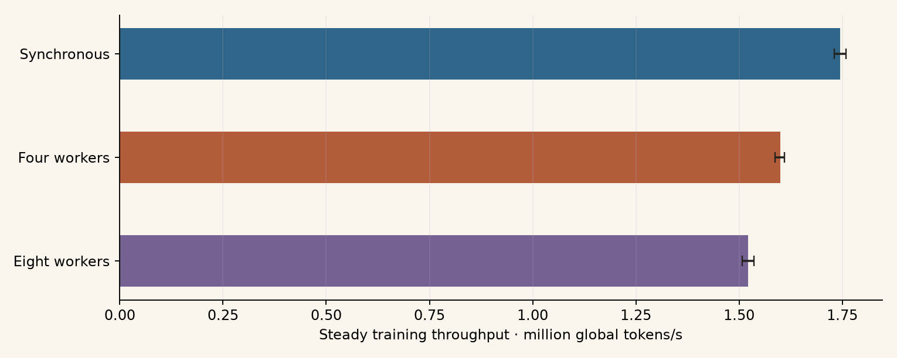

## Current measurements

These measurements use the same synchronous, four-worker, and eight-worker
experiments as the [tuning results](../results/overview.md). All workers execute
on one NVIDIA GH200 120GB with a 131,072-target global batch and 20.4M parameters
per model. The software is Python 3.12.13, PyTorch 2.14.0, and CUDA 13.0;
BF16 autocast, FP32 parameters, compiled SDPA, and fused AdamW are enabled.

[Figure PDF](../data/current-training/gh200-throughput.pdf) ·
[Per-run measurements CSV](../data/current-training/performance-runs.csv) ·
[All summary distributions JSON](../data/current-training/performance.json)

The figure uses the 80-token horizon. The table includes every completed run,
grouped by training mode and horizon. Values are medians across runs; brackets
give the interquartile range. Hardware scheduling and execution variability are
part of these observed campaign measurements.

<!-- performance:start -->

Measurements from jobs started **2026-09-16–2026-09-17 (UTC)**, as recorded in their execution environments. Snapshot: 2026-09-17.

| Mode | Tokens/parameter | Runs | Steady M tokens/s [IQR] | Recorded training M tokens/s | Elapsed M tokens/s | Full validation s | Session s | Peak GiB |
| --- | ---: | ---: | ---: | ---: | ---: | ---: | ---: | ---: |
| Synchronous | 20 | 72 | 1.756 [1.742, 1.770] | 1.434 | 1.324 | 100.9 | 410.2 | 39.48 |
| Synchronous | 40 | 72 | 1.749 [1.739, 1.765] | 1.614 | 1.481 | 101.2 | 653.5 | 39.48 |
| Synchronous | 80 | 72 | 1.745 [1.730, 1.758] | 1.672 | 1.529 | 101.4 | 1168.7 | 39.48 |
| Four workers | 20 | 144 | 1.597 [1.581, 1.608] | 1.474 | 1.361 | 101.3 | 402.0 | 40.78 |
| Four workers | 40 | 144 | 1.600 [1.586, 1.612] | 1.537 | 1.416 | 101.3 | 677.9 | 40.78 |
| Four workers | 80 | 144 | 1.599 [1.587, 1.610] | 1.561 | 1.437 | 101.4 | 1238.0 | 40.78 |
| Eight workers | 20 | 180 | 1.519 [1.509, 1.536] | 1.411 | 1.306 | 101.1 | 413.9 | 42.29 |
| Eight workers | 40 | 180 | 1.521 [1.506, 1.537] | 1.466 | 1.355 | 101.3 | 704.2 | 42.29 |
| Eight workers | 80 | 180 | 1.522 [1.508, 1.535] | 1.487 | 1.375 | 101.2 | 1288.5 | 42.29 |

<!-- performance:end -->

## Timing boundaries

- **Steady throughput:** within each run, sum tokens and duration across complete
  training log windows whose starting step is at least 312. Divide total tokens
  by total duration. This excludes the initial warmup/compilation windows and
  epoch validation, while including data loading and update overhead.
- **Recorded training throughput:** the trainer's total session training tokens
  divided by accumulated training-window time, including initial compilation.
  Epoch evaluation and checkpoint work are excluded from those windows.
- **Elapsed training throughput:** session training tokens divided by time from
  the start of updates through epoch evaluation and final checkpoint handling.
  It excludes the final full-validation pass.
- **Full-validation time:** the duration of that final evaluation pass alone.
- **Session duration:** the trainer's recorded session timer, beginning before
  fixed-subset collection and ending after full validation. It excludes earlier
  process imports, model setup, launcher overhead, and queue time.
- **Peak GiB:** the trainer's peak CUDA allocated memory since its reset before
  subset collection, including subsequent training and evaluation; it is not
  total device usage or reserved memory.

All rates use global prediction targets. The cosine sweeps saved no checkpoints.
These timings describe the recorded training workload rather than a synthetic
update benchmark or physical multi-GPU scaling experiment.

## Evidence and refresh

The [publication dataset](../data/current-training/dataset.json) records the
snapshot date and execution environment. [Per-run records](../data/current-training/runs.csv)
link metrics, final results, and resolved settings. The [retained source map](../data/current-training/sources.json)
records original paths and hashes.

The [publication exporter](../guides/website.md) regenerates these measurements
from compressed logs retained in the documentation. Earlier measurements,
including data-loading investigations, remain in the
[historical training-performance report](../archive/training-performance.md).

Data-loading measurements from earlier implementations are preserved in that archive.
