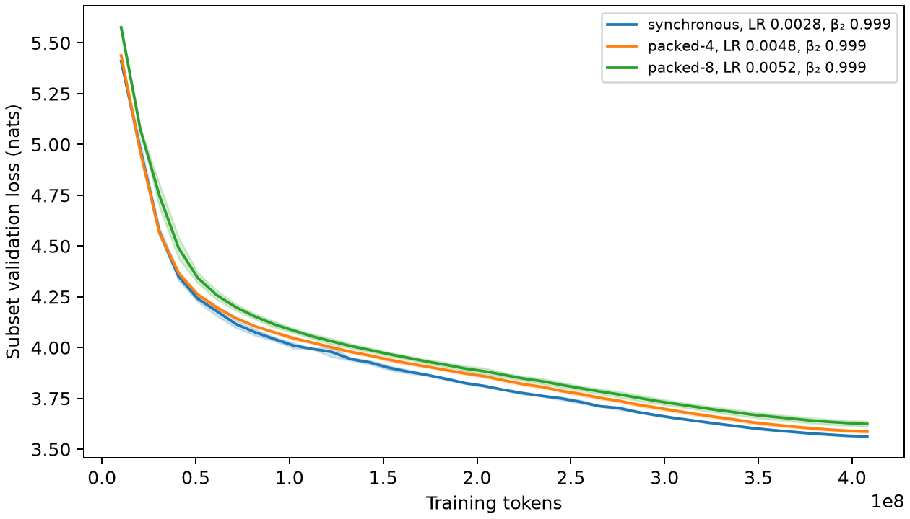

# 20M training-recipe benchmark

Measured on 2026-09-09: **324 successful runs**, covering 108 LR/beta2
combinations across synchronous, packed-4, and packed-8 training. Each
combination uses runtime seeds **42, 43, and 44**. The final audit verified full
validation, the saved recipes, and one `final.pt` per successful run.

## Best tested recipes

Selection minimizes mean final-checkpoint full C4 validation cross-entropy
(nats) across the three seeds, separately for each mode. The reported uncertainty
is the **sample standard deviation**, not a confidence interval. Combinations
must have all three seeds; exact ties favor lower LR, then lower beta2.

| Mode | LR | Beta2 | Mean loss | Sample SD | Configuration |
|---|---:|---:|---:|---:|---|
| Synchronous | 0.0028 | 0.999 | 3.564370 | 0.003590 | [YAML](recipe_sweep_20m/selected-synchronous.yaml) |
| Packed-4 | 0.0048 | 0.999 | 3.587822 | 0.006839 | [YAML](recipe_sweep_20m/selected-packed-4.yaml) |
| Packed-8 | 0.0052 | 0.999 | 3.624001 | 0.011932 | [YAML](recipe_sweep_20m/selected-packed-8.yaml) |

The synchronous and packed-4 winners lie inside their searched LR ranges.
Packed-8 still selects the largest tested LR, so this grid does not locate its
upper optimum. Synchronous LR 0.0028 beats LR 0.0022 by only 0.000135 nats;
packed-8 LR 0.0052 beats LR 0.0048 by 0.001538 nats. Both differences are small
relative to the observed seed variation. The rankings alone do not establish
statistically reliable improvements.

These configurations record the 32,768-token-batch benchmark. This campaign
left preset optimizer settings unchanged at the time. The synchronous 20M
preset now uses the [128K-token sweep winner](recipe_sweep_20m_128k.md).
The packed-4 preset now uses its own
[128K-token exponential-topology winner](recipe_sweep_packed4_20m_128k.md).
The earlier single-seed, multi-size campaign is
reported separately in [campaign_results.md](campaign_results.md).

## Search grid and fixed settings

| Mode | Learning rates | Beta2 | Seeds | Runs |
|---|---|---|---|---:|
| Synchronous | 0.0008, 0.0010, 0.0012, 0.0014, 0.0016, 0.0018, 0.0020, 0.0022, 0.0024, 0.0026, 0.0028, 0.0030 | 0.95, 0.98, 0.999 | 42, 43, 44 | 108 |
| Packed-4 | 0.0010, 0.0012, 0.0016, 0.0020, 0.0024, 0.0028, 0.0032, 0.0036, 0.0040, 0.0044, 0.0048, 0.0052 | 0.95, 0.98, 0.999 | 42, 43, 44 | 108 |
| Packed-8 | 0.0010, 0.0012, 0.0016, 0.0020, 0.0024, 0.0028, 0.0032, 0.0036, 0.0040, 0.0044, 0.0048, 0.0052 | 0.95, 0.98, 0.999 | 42, 43, 44 | 108 |

The initial 108-run grid was extended four times by 54 runs. Completed
experiments were reused, with their artifacts unchanged. Every extension used
the original frozen trainer and inherited the saved configuration, changing
only LR and the output directory. The final extension reused 270 completed runs.

All runs use the 20,403,520-parameter model (per local model in packed training):
eight layers, width 320, five heads, FFN width 896, vocabulary 32,000, and context
length 1,024. AdamW uses beta1 0.9,
epsilon 1e-8, weight decay 0.1, and gradient clipping at 1.0. The schedule has
5% linear warmup followed by cosine decay to 10% of peak LR. Training uses BF16
autocast, compilation, SDPA attention, fused AdamW, and `deterministic=false`.

| Mode | Local models | Microbatch sequences per model | Global batch tokens | Virtual epochs | Training targets |
|---|---:|---:|---:|---:|---:|
| Synchronous | 1 | 32 | 32,768 | 40 | 408,071,168 |
| Packed-4 | 4 | 8 | 32,768 | 40 | 408,068,096 |
| Packed-8 | 8 | 4 | 32,768 | 40 | 408,068,096 |

Packed training uses **one-peer ring** topology with local optimizer states.
Evaluation uses the global parameter average. Each job runs on one NVIDIA
GH200 120GB, so the packed modes simulate decentralized training on one GPU;
these measurements do not include physical network costs. The Slurm campaign
allowed 40 concurrent jobs with a 30-minute limit per job. The recorded software
environment is Python 3.12.13, PyTorch 2.14.0, and CUDA 13.0.

## Data, evaluation, and checkpoint retention

All runs use the same prepared `allenai/c4` cache and TinyLlama tokenizer.
Preprocessing shuffle seed 42 and validation seed 12345 remain fixed while
`runtime.seed` varies. Dataset and tokenizer revisions and cache identity are
retained in [results.json](recipe_sweep_20m/results.json) and the selected YAMLs.

Each final checkpoint is evaluated over the same **197,411,295 C4 validation
prediction targets**. Epoch evaluations use a fixed 1,024-block subset and
continue to record best-loss statistics. Selection uses the final full-validation
loss, rather than the best intermediate subset loss. Validation is also used for
selection; there is no independent test-set estimate in this benchmark.

All runs use `training.checkpoint_policy: final`: only `final.pt` is retained,
with no periodic, epoch, worker-weight, or interruption checkpoint exports.
Packed final checkpoints retain every local model and optimizer state and
support evaluation of averaged weights. `best.json` contains subset statistics
with `weights: null`. Failed attempts and logs from earlier submissions remain
in the local campaign archive; they are not additional experimental seeds.

## Learning-rate response at beta2 = 0.999

Each cell is mean final full-validation loss ± sample SD over three seeds.
A dash denotes an LR that was not tested in that mode. Results for every beta2
are in the [108-row summary CSV](recipe_sweep_20m/summary.csv).

| LR | Synchronous | Packed-4 | Packed-8 |
|---:|---:|---:|---:|
| 0.0008 | 3.588713 ± 0.007140 | — | — |
| 0.0010 | 3.581478 ± 0.006324 | 3.634579 ± 0.003744 | 3.710819 ± 0.006792 |
| 0.0012 | 3.569573 ± 0.002860 | 3.620119 ± 0.006653 | 3.689397 ± 0.006961 |
| 0.0014 | 3.566896 ± 0.002125 | — | — |
| 0.0016 | 3.570824 ± 0.004557 | 3.606654 ± 0.001872 | 3.666961 ± 0.007703 |
| 0.0018 | 3.566512 ± 0.008356 | — | — |
| 0.0020 | 3.568652 ± 0.007927 | 3.595806 ± 0.003967 | 3.660161 ± 0.004760 |
| 0.0022 | 3.564505 ± 0.007247 | — | — |
| 0.0024 | 3.565026 ± 0.006815 | 3.596458 ± 0.003870 | 3.653890 ± 0.001180 |
| 0.0026 | 3.566678 ± 0.005947 | — | — |
| 0.0028 | 3.564370 ± 0.003590 | 3.593501 ± 0.000826 | 3.646855 ± 0.007799 |
| 0.0030 | 3.572076 ± 0.004650 | — | — |
| 0.0032 | — | 3.593771 ± 0.012870 | 3.647980 ± 0.012512 |
| 0.0036 | — | 3.591065 ± 0.006906 | 3.638749 ± 0.012406 |
| 0.0040 | — | 3.593467 ± 0.003287 | 3.632477 ± 0.008548 |
| 0.0044 | — | 3.593090 ± 0.001265 | 3.632167 ± 0.004848 |
| 0.0048 | — | 3.587822 ± 0.006839 | 3.625539 ± 0.006993 |
| 0.0052 | — | 3.591678 ± 0.004363 | 3.624001 ± 0.011932 |

## Plots and complete results

- Full-grid heatmaps: [PDF](recipe_sweep_20m/heatmaps.pdf),
  [PNG](recipe_sweep_20m/heatmaps.png). The full-size files show all 12 LRs per mode.
- Winning validation curves: [PDF](recipe_sweep_20m/validation-curves.pdf),
  [PNG](recipe_sweep_20m/validation-curves.png),
  [curve data](recipe_sweep_20m/validation_curves.csv).
- [Per-run CSV](recipe_sweep_20m/runs.csv): 324 final-validation results.
- [Grouped CSV](recipe_sweep_20m/summary.csv): 108 complete combinations and ranks.
- [JSON results and provenance](recipe_sweep_20m/results.json): exact per-run and
  grouped values, selections, grid, seeds, revisions, environment, and job IDs.



The curves plot epoch **subset-validation** loss, with a mean line and a band
of ± one sample SD across seeds. Their points are not the full-validation values
used to rank the recipes above.

## Reproduction and provenance

The selected YAMLs preserve the measured settings and pinned data revisions,
with `data.cache_dir` changed to `data/c4` and output directories made relative
to the repository. Prepare the cache as described in the [README](../README.md),
then use the standard training command, for example:

```bash
uv run tiny-llm train --config doc/recipe_sweep_20m/selected-synchronous.yaml \
  --set runtime.seed=42 --set runtime.output_dir=runs/20m-selected-synchronous-seed42
```

Use the corresponding packed YAML for four or eight local models. Repeat with
seeds 43 and 44 in separate output directories to match the three-seed protocol.
`deterministic=false` means these recipes do not promise bitwise reproduction.
The sweep-specific orchestration was removed from the main source package;
these configurations use the regular training entrypoint.

The local `runs/recipe-sweep-20m` archive contains the frozen training source,
resolved configurations, checkpoints, metrics, submission receipts, failed logs,
previous reports, and removed sweep tools. The per-run CSV's `directory` field
is relative to that archive. Large training artifacts are gitignored; the
results and plots linked here are committed documentation.

The original training source hash is
`846d7aa92b4eb968891e84bbfa2a205ab899f28a437be1fa81dfe08c8cfc8dd3`.
Cache identity is
`8cf0c4883c19d26f378623f91bfe079bc8ebf8f23e51814821f4c8c28c4b8151`.
The final audit checked all 324 successful results, recipe settings, complete
validation, final-only checkpoint retention, all grouped means and sample SDs,
and the selected configurations. The final 54-run extension left the prior 270
run records and 1,080 tracked run artifacts unchanged.
