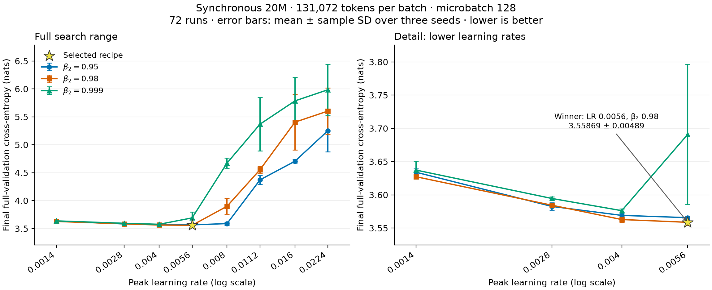

# Synchronous 20M tuning at 128K tokens per batch

Measured on **2026-09-11**: all **72 runs** completed and passed the configuration,
token-budget, full-validation, and final-checkpoint audit. The winning recipe is
now the synchronous preset in [`configs/20m.yaml`](../configs/20m.yaml):
**LR 0.0056, AdamW beta2 0.98, batch 131,072 tokens, microbatch 128**.
At context length 1,024, each full update uses one microbatch, without gradient
accumulation. Packed presets are unchanged.

## Results

Selection minimizes mean final-checkpoint full C4 validation cross-entropy
over runtime seeds **42, 43, and 44**, breaking exact ties by lower LR, then
lower beta2. Error bars and ± values are the **sample standard deviation**
across seeds, not confidence intervals.



The left panel includes every LR/beta2 combination. The right panel shows the
same statistics for learning rates up to 0.0056 on a narrower loss scale.
The star marks the selected recipe. Download the [PDF](recipe_sweep_20m_128k/tuning.pdf)
or [PNG](recipe_sweep_20m_128k/tuning.png).

| Rank | Learning rate | Beta2 | Mean loss (nats) | Sample SD |
|---|---:|---:|---:|---:|
| 1 | 0.0056 | 0.98 | 3.558689 | 0.004887 |
| 2 | 0.0040 | 0.98 | 3.562837 | 0.004298 |
| 3 | 0.0056 | 0.95 | 3.565663 | 0.002401 |
| 4 | 0.0040 | 0.95 | 3.569091 | 0.003603 |
| 5 | 0.0040 | 0.999 | 3.576206 | 0.002682 |

The winner lies inside the tested LR and beta2 ranges. Its 0.004148-nat advantage
over LR 0.0040 at the same beta2 is comparable to the observed seed variation;
this ranking alone does not establish a statistically reliable improvement.
Higher LRs generally worsen loss and can increase seed variation. Those poor
outcomes are retained in the results; all runs completed with finite losses.

The earlier [32K-token synchronous winner](recipe_sweep_20m.md) measured
3.564370 ± 0.003590 at LR 0.0028 and beta2 0.999. The new winner is lower by
0.005681 nats, but this compares separately tuned campaigns, not an isolated
batch-size experiment. Both campaigns use validation for selection, with no
independent test estimate. These results establish the best tested recipe in
this grid, not batch-size optimality.

## Search and fixed protocol

| Setting | Value |
|---|---|
| Learning rates | 0.0014, 0.0028, 0.0040, 0.0056, 0.0080, 0.0112, 0.0160, 0.0224 |
| Beta2 | 0.95, 0.98, 0.999 |
| Runtime seeds | 42, 43, 44 |
| Model | 20,403,520 unique parameters; 8 layers, width 320, 5 heads, FFN width 896 |
| Vocabulary / context | 32,000 / 1,024 |
| Batch / microbatch | 131,072 prediction targets / 128 sequences; no accumulation |
| Training budget | 408,071,168 targets; 40 virtual epochs; 3,120 optimizer updates |
| Other AdamW settings | Beta1 0.9, epsilon 1e-8, weight decay 0.1, gradient clipping 1.0 |
| Schedule | 5% token-based linear warmup, cosine decay to 10% of peak LR |
| Epoch validation | Fixed 1,024-block subset, validation seed 12345 |
| Final validation | Full C4 split: 197,411,295 prediction targets per run |
| Execution | BF16 autocast, FP32 parameters, compiled SDPA, fused AdamW, 8 CPU threads |
| Checkpoints | Final only: one `final.pt` per run |

Epoch-ending updates are shortened to preserve the existing virtual epoch
boundaries and exact training budget; they use their actual target counts.
The schedule follows consumed tokens. Dataset preprocessing shuffle seed 42
and validation seed 12345 stay fixed while the runtime seed varies.
`deterministic=false` allows fast kernels and does not promise bitwise replay.

Each run used one NVIDIA GH200 120GB, Python 3.12.13, PyTorch 2.14.0, and CUDA
13.0. The full-budget pilot was job `2309169_0`; the remaining runs were array
`2309171`, capped at 24 concurrent GPUs with a 30-minute limit per allocation.
All jobs exited successfully, including the slower `2309171_59`.
The cancelled microbatch-32 pilot and its dependent array are excluded.

## Artifacts and reproduction

- [Per-run CSV](recipe_sweep_20m_128k/runs.csv): all 72 losses, seeds, job IDs,
  durations, and archive-relative run directories.
- [Summary CSV](recipe_sweep_20m_128k/summary.csv): all 24 combinations, sorted
  by mean loss, with three seeds and sample SD for each.
- [Results and provenance](recipe_sweep_20m_128k/results.json): audited run
  metrics, grouped results, source hashes, cache identity, and environment.
- [Plot script](recipe_sweep_20m_128k/plot.py): regenerates the figure from the
  adjacent summary CSV, without needing the large training archive.

The preset matches the measured winner, including pinned C4 and tokenizer
revisions, with portable `data/c4` and `runs/20m` paths. After preparing the cache
as described in the [README](../README.md#training), reproduce a seed with:

```bash
uv run tiny-llm train --config configs/20m.yaml \
  --set runtime.seed=42 --set runtime.output_dir=runs/20m-128k-seed42
```

Repeat with seeds 43 and 44 in separate output directories for the three-seed
comparison. Regenerate the plot from the repository root with:

```bash
uv run python doc/recipe_sweep_20m_128k/plot.py
```

The gitignored archive `runs/sync-20m-batch128k-micro128-20260911/` retains the
sweep scripts, frozen trainer, all 72 configs, logs, and checkpoints. Its source
commit is `12dea70ca74a31f368d13e88267377a7198bb0b1`; cache identity is
`8cf0c4883c19d26f378623f91bfe079bc8ebf8f23e51814821f4c8c28c4b8151`.
The preset update does not alter those archived recipes or results.
