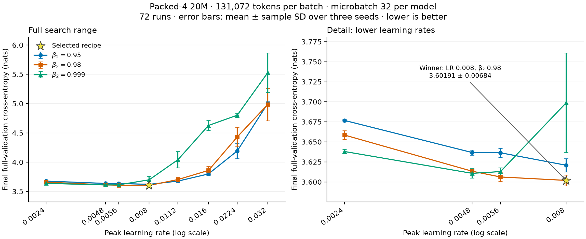

# Packed-4 20M tuning at 128K tokens per batch

Measured on **2026-09-11**: all **72 runs** completed successfully and passed
the configuration, token-budget, full-validation, and final-checkpoint audit.
The winner is now [`configs/packed-20m.yaml`](../configs/packed-20m.yaml):
**LR 0.008, AdamW beta2 0.98, four local models, microbatch 32 per model**.
The global batch is **131,072 prediction targets**, with no accumulation.
The topology is `one_peer_exponential`; adaptive consensus is disabled.

## Results

Selection minimizes mean final-checkpoint full C4 validation cross-entropy of
the globally averaged model across runtime seeds **42, 43, and 44**. Exact
ties favor lower LR, then lower beta2. Error bars and ± values show the
**sample standard deviation** across seeds, not confidence intervals.



The left panel covers all 24 LR/beta2 combinations; the right panel shows the
same statistics for LRs up to 0.008 on a narrower loss scale. The star marks
the selected recipe. Download the [PDF](recipe_sweep_packed4_20m_128k/tuning.pdf)
or [PNG](recipe_sweep_packed4_20m_128k/tuning.png).

| Rank | Learning rate | Beta2 | Mean loss (nats) | Sample SD |
|---|---:|---:|---:|---:|
| 1 | 0.0080 | 0.98 | 3.601910 | 0.006842 |
| 2 | 0.0056 | 0.98 | 3.606178 | 0.005628 |
| 3 | 0.0048 | 0.999 | 3.610736 | 0.005867 |
| 4 | 0.0056 | 0.999 | 3.612911 | 0.004840 |
| 5 | 0.0048 | 0.98 | 3.613361 | 0.000911 |

The winner is inside both searched parameter ranges. Its 0.004268-nat advantage
over LR 0.0056 at the same beta2 is smaller than the observed seed SDs, so the
ranking alone does not establish a statistically reliable improvement.
Higher LRs generally increase loss and seed variation; all outcomes are
retained, including poorly performing runs with finite losses.

The [synchronous 128K-token winner](recipe_sweep_20m_128k.md) measured
3.558689 ± 0.004887. This packed winner is 0.043221 nats higher. The packed
model uses local optimizer states and topology mixing, with evaluation at
averaged weights; this comparison does not isolate a single algorithmic effect.
The earlier [32K-token packed-4 sweep](recipe_sweep_20m.md) used a ring topology,
so it also differs in topology as well as batch size. These are validation-based
selections without an independent test estimate or a claim of global optimality.

## Tuning process and fixed settings

The sweep started from the current packed preset, preserving its exponential
topology, equal-worker epoch boundaries, and total token budget. Only batch size,
local microbatch size, LR, beta2, runtime seed, pinned data revisions, and output
paths were configured for the campaign. Each run used the same frozen trainer.

| Setting | Value |
|---|---|
| Learning rates | 0.0024, 0.0048, 0.0056, 0.008, 0.0112, 0.016, 0.0224, 0.032 |
| Beta2 | 0.95, 0.98, 0.999 |
| Runtime seeds | 42, 43, 44 |
| Local models | 4 × 20,403,520 unique parameters; 81,614,080 total |
| Architecture per model | 8 layers, width 320, 5 heads, FFN width 896, vocabulary 32,000 |
| Context / local microbatch | 1,024 tokens / 32 sequences |
| Global batch | 4 × 32 × 1,024 = 131,072 targets; no accumulation |
| Training budget | 408,068,096 global targets; 102,017,024 per local model |
| Epochs / updates | 40 virtual epochs / 3,119 optimizer updates |
| Local AdamW | Beta1 0.9, epsilon 1e-8, weight decay 0.1, per-model clipping 1.0 |
| Schedule | 5% token-based linear warmup, cosine decay to 10% of peak LR |
| Epoch validation | Averaged model, fixed 1,024-block subset, seed 12345 |
| Final validation | Averaged model, full C4 split: 197,411,295 targets |
| Execution | BF16 autocast, FP32 parameters, compiled SDPA, fused local AdamW, 8 CPU threads |
| Retention | One final packed checkpoint per run, retaining local weights and optimizer states |

Epoch-ending updates are shortened, maintaining equal local batch sizes and
using actual target counts. The schedule follows globally consumed tokens.
All runs use the same prepared C4 cache and TinyLlama tokenizer, pinned to the
revisions in the preset. Preprocessing seed 42 and validation seed 12345 stay
fixed. Runtime seeds vary initialization and training order. Fast kernels with
`deterministic=false` do not promise bitwise replay.

The full-budget pilot, job `2310341_0`, used LR 0.008, beta2 0.999, and seed 42.
Its successful completion and artifact audit released array `2310342` for the
remaining 71 runs. The array allowed 24 concurrent GPUs, each with one GH200 and
a 30-minute allocation limit. All 72 jobs exited with code 0; no retry or grid
extension was needed. Each run trained the complete budget, evaluated the full
validation split, and was audited before inclusion in the three-seed ranking.

Jobs used NVIDIA GH200 120GB GPUs, Python 3.12.13, PyTorch 2.14.0, and CUDA 13.0.
Each allocation simulated all four models on one GPU; these measurements do
not include physical inter-node communication costs. Compiler caches were
isolated per allocation. Sweep scripts and large training artifacts remain
gitignored; the preset and report are the tracked outputs of this campaign.

## Artifacts and reproduction

- [Per-run CSV](recipe_sweep_packed4_20m_128k/runs.csv): 72 losses, seeds,
  job IDs, durations, and archive-relative directories.
- [Summary CSV](recipe_sweep_packed4_20m_128k/summary.csv): all 24 combinations,
  ranked by mean loss, with sample SD and seed count.
- [Results and provenance](recipe_sweep_packed4_20m_128k/results.json): complete
  metrics, source hashes, environment, cache identity, and grouped results.
- [Plot script](recipe_sweep_packed4_20m_128k/plot.py): regenerates the figure
  from the adjacent summary CSV without the training archive.

The portable preset matches the measured winner except for cache and output
locations. With the cache prepared as described in the [README](../README.md#training):

```bash
uv run tiny-llm train --config configs/packed-20m.yaml \
  --set runtime.seed=42 --set runtime.output_dir=runs/packed4-20m-128k-seed42
```

Repeat with seeds 43 and 44 and separate output directories for the three-seed
comparison. The adaptive-consensus preset remains a separate, untuned-at-128K
recipe. Regenerate the plot from the repository root with:

```bash
uv run python doc/recipe_sweep_packed4_20m_128k/plot.py
```

The gitignored archive is `runs/packed4-20m-batch128k-micro32-20260911/`.
Its manifest records the frozen source commit and every source/config hash;
`source/`, `configs/`, and `experiments/` retain the original training inputs
and outputs. The tracked JSON preserves source provenance and cache identity.
Updating the preset does not modify the archived recipes or results.
