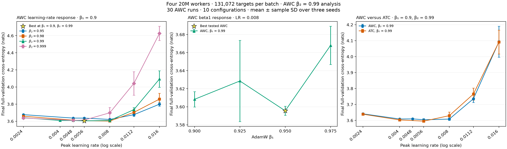

# AWC beta2 = 0.99 analysis for packed-4 20M at 128K tokens per batch

This report covers **all 30 AWC runs and 10 configurations at beta2 0.99**
from the [129-run AWC study](recipe_sweep_packed4_20m_128k.md), with runtime seeds
**42, 43, and 44** for every configuration. It analyzes learning-rate response at
beta1 0.9, beta1 sensitivity at LR 0.008, and matched comparisons with ATC.

The best tested recipe is **LR 0.008, beta1 0.95, beta2 0.99**, with mean final
full-validation loss **3.595559 ± 0.005025** nats. This is also the overall AWC
winner and is provided in [configs/packed4-20m-awc.yaml](../configs/packed4-20m-awc.yaml).
At fixed beta1 0.9, the best tested LR is **0.0056**, with loss
**3.604343 ± 0.007428**, provided in
[configs/packed4-20m-awc-beta99.yaml](../configs/packed4-20m-awc-beta99.yaml).
All ± values and error bars are sample standard deviations over three seeds.

## Search coverage and results

| Search slice | LR | Beta1 | Configurations | Runs |
|---|---|---|---:|---:|
| Learning-rate response | 0.0024, 0.004, 0.0048, 0.0056, 0.008, 0.0112, 0.016 | 0.9 | 7 | 21 |
| Beta1 response | 0.008 | 0.9, 0.925, 0.95, 0.975 | 4 | 12 |

The slices share the three runs at LR 0.008 and beta1 0.9, giving 30 unique
runs. Beta2 is 0.99 throughout. The LR/beta1 search is not rectangular:
beta1 values above 0.9 were evaluated only at LR 0.008.



[PDF](recipe_sweep_packed4_awc_beta99_20m_128k/tuning.pdf) ·
[PNG](recipe_sweep_packed4_awc_beta99_20m_128k/tuning.png).
The LR panel includes the other AWC beta2 values at beta1 0.9 for context,
restricted to LR ≤ 0.016. Lines connect measured points.

Selection minimizes mean final full-validation cross-entropy over all three
seeds, breaking exact ties by lower LR, then beta1. All ten configurations are
ranked below; all finite outcomes are retained.

| Rank | LR | Beta1 | Mean loss (nats) | Sample SD |
|---|---:|---:|---:|---:|
| 1 | 0.008 | 0.95 | 3.595559 | 0.005025 |
| 2 | 0.0056 | 0.9 | 3.604343 | 0.007428 |
| 3 | 0.008 | 0.9 | 3.608260 | 0.008515 |
| 4 | 0.004 | 0.9 | 3.608885 | 0.001868 |
| 5 | 0.0048 | 0.9 | 3.609485 | 0.004022 |
| 6 | 0.008 | 0.925 | 3.628551 | 0.045025 |
| 7 | 0.0024 | 0.9 | 3.641324 | 0.004076 |
| 8 | 0.008 | 0.975 | 3.667934 | 0.021182 |
| 9 | 0.0112 | 0.9 | 3.735541 | 0.023741 |
| 10 | 0.016 | 0.9 | 4.093433 | 0.096776 |

At beta1 0.9, the lowest mean is at LR 0.0056; LR 0.004, 0.0048, and 0.008 are
close relative to seed variation. Loss rises at LR 0.0112 and 0.016. At LR 0.008,
beta1 0.95 has the lowest mean, while beta1 0.925 shows substantial seed
variation and beta1 0.975 has a higher mean. The available data does not resolve
whether beta1 0.95 benefits other learning rates.

## Comparison with ATC

The six comparisons below fix beta1 0.9 and beta2 0.99 and match learning rate
and runtime seeds. Negative differences favor ATC. ATC has no measurement at
LR 0.0048 or at beta1 above 0.9.

| LR | AWC mean ± SD | ATC mean ± SD | ATC − AWC |
|---|---:|---:|---:|
| 0.0024 | 3.641324 ± 0.004076 | 3.638942 ± 0.004437 | -0.002382 |
| 0.004 | 3.608885 ± 0.001868 | 3.603139 ± 0.005687 | -0.005745 |
| 0.0056 | 3.604343 ± 0.007428 | 3.595506 ± 0.003221 | -0.008837 |
| 0.008 | 3.608260 ± 0.008515 | 3.629706 ± 0.022798 | +0.021446 |
| 0.0112 | 3.735541 ± 0.023741 | 3.765067 ± 0.038261 | +0.029526 |
| 0.016 | 4.093433 ± 0.096776 | 4.091881 ± 0.074687 | -0.001552 |

ATC has lower means at the three matched LRs below 0.008; AWC has lower means
at 0.008 and 0.0112. At 0.016, the mean difference is small relative to seed
variation. The [best tested ATC recipe](recipe_sweep_packed4_atc_20m_128k.md),
LR 0.0056, beta1 0.9, beta2 0.99, measures **3.595506 ± 0.003221**.
Its mean is **0.000053 nats lower** than the best AWC recipe at beta1 0.95,
far smaller than the observed seed variation. Separately selected recipes use
different LR and beta1 values, so that comparison does not isolate mixing order.
Three seeds and validation-based selection do not establish statistical
significance, equivalence, or a global optimum; there is no independent test estimate.

## Protocol and data

All measurements use four 20,403,520-parameter workers with
`one_peer_exponential` topology. AWC computes and clips local gradients, mixes
parameters, then applies local AdamW; optimizer moments remain local and adaptive
consensus is disabled. Global batch size is 131,072 targets, with context 1,024
and microbatch 32 sequences per worker, without accumulation.

Training uses 408,068,096 global targets (102,017,024 per worker), 40 epochs,
and 3,119 updates. AdamW uses weight decay 0.1, epsilon 1e-8, local clipping 1.0,
5% token-based linear warmup, and cosine decay to 10% of peak LR. Epoch evaluation
uses a fixed 1,024-block subset; final evaluation uses all 197,411,295 targets in
the C4 validation split. Both evaluate the globally averaged model.

Preprocessing seed 42 and validation seed 12345 are fixed. Runtime seeds vary
initialization and sample order. Execution uses a GH200 120GB, BF16 autocast,
FP32 weights, compiled SDPA, and fused AdamW. Each allocation simulates four
workers on one GPU, so physical inter-node communication costs are not measured.
One final packed checkpoint is retained per run.

All 30 jobs completed with exit code 0. Resolved recipes, frozen sources and
dependencies, runtime versions, token and step counts, validation completion,
and final checkpoints were audited as part of the complete AWC dataset. All ten
means and sample SDs use exactly seeds 42, 43, and 44. Per-run artifact locations
and source provenance are retained in the linked data.

- [Per-run CSV](recipe_sweep_packed4_awc_beta99_20m_128k/runs.csv): all 30 AWC measurements at beta2 0.99.
- [Summary CSV](recipe_sweep_packed4_awc_beta99_20m_128k/summary.csv): all ten configurations.
- [Matched ATC comparison](recipe_sweep_packed4_awc_beta99_20m_128k/atc-comparison.csv).
- [Results](recipe_sweep_packed4_awc_beta99_20m_128k/results.json): metrics and hashes of the complete source datasets.
- [Complete AWC provenance](recipe_sweep_packed4_20m_128k/results.json): input hashes, source origins, and accounting.
- [Plot script](recipe_sweep_packed4_awc_beta99_20m_128k/plot.py).

## Reproduction

With the prepared cache, reproduce the best tested AWC recipe:

```bash
uv run tiny-llm train --config configs/packed4-20m-awc.yaml
```

For the best recipe conditional on beta1 0.9, use
`--config configs/packed4-20m-awc-beta99.yaml`. Repeat with
`--set runtime.seed=43` and `44` in separate output directories. Override
`optimizer.lr` and `optimizer.beta1` to reproduce other measured configurations.
Regenerate the figure with:

```bash
uv run python doc/recipe_sweep_packed4_awc_beta99_20m_128k/plot.py
```
