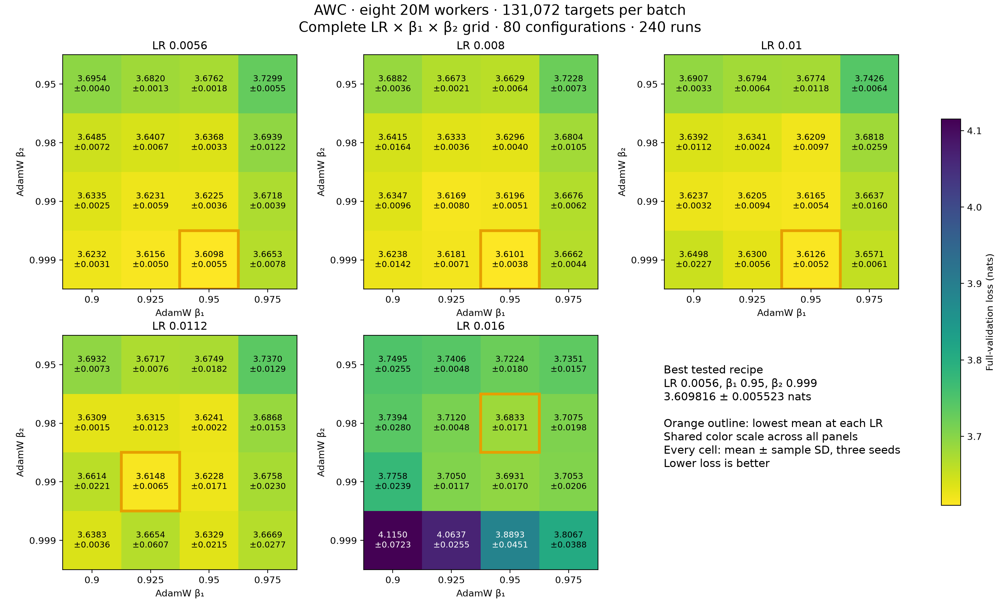
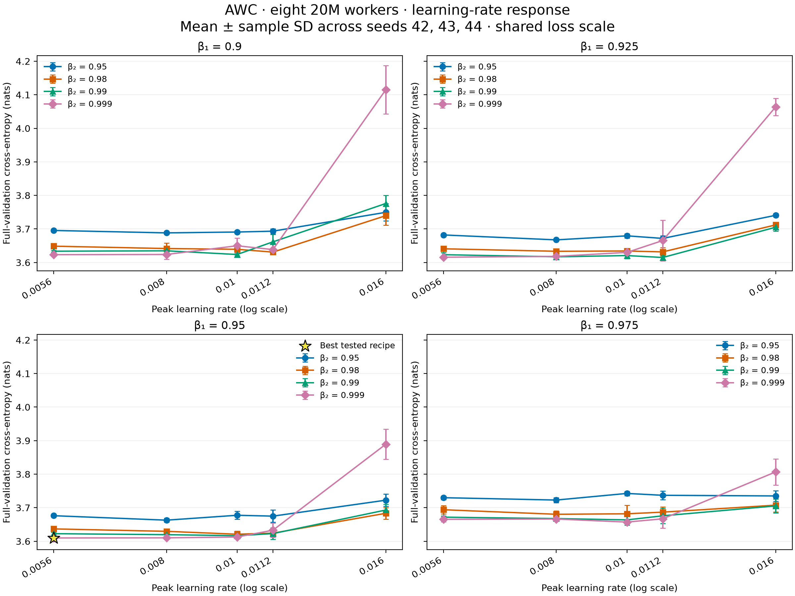

# AWC packed-8 20M tuning at 128K tokens per batch

Measured on **2026-09-12**: **240 successful runs** covering the complete
**80-configuration LR/beta1/beta2 grid**, with runtime seeds **42, 43, and 44**
for every configuration. Each run trains **eight local 20M models** using AWC.

The best tested recipe is **LR 0.0056, beta1 0.95, beta2 0.999**,
with mean final full-validation cross-entropy **3.609816 ± 0.005523**
nats. All ± values and error bars are **sample standard deviations across the
three seeds**, not confidence intervals. Lower loss is better.

LR 0.008 with the same betas measures **3.610121 ± 0.003780**,
only **0.000305 nats higher**. This gap is small relative to
seed variation. The winner is at the **lowest tested LR and highest tested beta2**;
the search does not locate an interior optimum in those dimensions. Selection
uses validation data, with no independent test estimate. These results do not
establish statistical significance, equivalence, or global optimality.

## Search space

| Parameter | Values |
|---|---|
| Learning rate | 0.0056, 0.008, 0.010, 0.0112, 0.016 |
| AdamW beta1 | 0.9, 0.925, 0.95, 0.975 |
| AdamW beta2 | 0.95, 0.98, 0.99, 0.999 |
| Runtime seeds | 42, 43, 44 |

The repeated 0.010 in the requested LR list is represented once. Every unique
combination has three runs: 5 × 4 × 4 × 3 = 240. All finite outcomes are included.
Ranking minimizes mean final full-validation loss, breaking exact ties by lower
LR, then beta1, then beta2. There are no missing or failed configurations.

## Beta1/beta2 heatmaps



[PDF](recipe_sweep_packed8_awc_20m_128k/heatmaps.pdf) ·
[PNG](recipe_sweep_packed8_awc_20m_128k/heatmaps.png).
Each panel contains 16 configurations and 48 seeded runs. All five panels share
a color scale; cells show mean ± sample SD. Orange outlines mark the lowest mean
within each LR, so the outlines are conditional selections.

The best configurations at each learning rate are:

| LR | Beta1 | Beta2 | Mean loss ± sample SD |
|---|---:|---:|---:|
| 0.0056 | 0.95 | 0.999 | 3.609816 ± 0.005523 |
| 0.008 | 0.95 | 0.999 | 3.610121 ± 0.003780 |
| 0.01 | 0.95 | 0.999 | 3.612587 ± 0.005239 |
| 0.0112 | 0.925 | 0.99 | 3.614815 ± 0.006469 |
| 0.016 | 0.95 | 0.98 | 3.683340 ± 0.017137 |

Beta1 0.95 and beta2 0.999 lead at LR 0.0056, 0.008, and 0.010. At LR 0.0112,
the lowest mean uses beta1 0.925 and beta2 0.99. At LR 0.016, beta1 0.95 and
beta2 0.98 perform best, but even that selected mean is
0.073524 nats above the overall minimum. The preferred
beta2 depends on LR; a single marginal average would obscure that relationship.

## Learning-rate response



[PDF](recipe_sweep_packed8_awc_20m_128k/tuning.pdf) ·
[PNG](recipe_sweep_packed8_awc_20m_128k/tuning.png).
Each panel fixes beta1 and shows all four beta2 curves across the five LRs.
Error bars show sample SD; all panels share the same loss scale. Lines connect
measured points. The star identifies the best tested configuration.

The three leading configurations use beta1 0.95 and beta2 0.999 across LRs
0.0056–0.010. Their closely spaced means support considering this region together
when interpreting the sweep. Higher LR does not improve the best achievable
mean within the measured beta grid; the selected minimum at LR 0.016 is clearly
higher in these measurements.

## Complete ranking

All 80 configurations are included below and in the
[summary CSV](recipe_sweep_packed8_awc_20m_128k/summary.csv).

| Rank | LR | Beta1 | Beta2 | Mean loss (nats) | Sample SD |
|---|---:|---:|---:|---:|---:|
| 1 | 0.0056 | 0.95 | 0.999 | 3.609816 | 0.005523 |
| 2 | 0.008 | 0.95 | 0.999 | 3.610121 | 0.003780 |
| 3 | 0.01 | 0.95 | 0.999 | 3.612587 | 0.005239 |
| 4 | 0.0112 | 0.925 | 0.99 | 3.614815 | 0.006469 |
| 5 | 0.0056 | 0.925 | 0.999 | 3.615585 | 0.004953 |
| 6 | 0.01 | 0.95 | 0.99 | 3.616493 | 0.005410 |
| 7 | 0.008 | 0.925 | 0.99 | 3.616854 | 0.008050 |
| 8 | 0.008 | 0.925 | 0.999 | 3.618110 | 0.007121 |
| 9 | 0.008 | 0.95 | 0.99 | 3.619603 | 0.005069 |
| 10 | 0.01 | 0.925 | 0.99 | 3.620530 | 0.009368 |
| 11 | 0.01 | 0.95 | 0.98 | 3.620946 | 0.009662 |
| 12 | 0.0056 | 0.95 | 0.99 | 3.622543 | 0.003616 |
| 13 | 0.0112 | 0.95 | 0.99 | 3.622809 | 0.017091 |
| 14 | 0.0056 | 0.925 | 0.99 | 3.623126 | 0.005860 |
| 15 | 0.0056 | 0.9 | 0.999 | 3.623235 | 0.003125 |
| 16 | 0.01 | 0.9 | 0.99 | 3.623731 | 0.003187 |
| 17 | 0.008 | 0.9 | 0.999 | 3.623785 | 0.014239 |
| 18 | 0.0112 | 0.95 | 0.98 | 3.624088 | 0.002247 |
| 19 | 0.008 | 0.95 | 0.98 | 3.629551 | 0.003996 |
| 20 | 0.01 | 0.925 | 0.999 | 3.630001 | 0.005558 |
| 21 | 0.0112 | 0.9 | 0.98 | 3.630861 | 0.001472 |
| 22 | 0.0112 | 0.925 | 0.98 | 3.631495 | 0.012256 |
| 23 | 0.0112 | 0.95 | 0.999 | 3.632872 | 0.021452 |
| 24 | 0.008 | 0.925 | 0.98 | 3.633303 | 0.003561 |
| 25 | 0.0056 | 0.9 | 0.99 | 3.633499 | 0.002481 |
| 26 | 0.01 | 0.925 | 0.98 | 3.634125 | 0.002443 |
| 27 | 0.008 | 0.9 | 0.99 | 3.634699 | 0.009648 |
| 28 | 0.0056 | 0.95 | 0.98 | 3.636775 | 0.003345 |
| 29 | 0.0112 | 0.9 | 0.999 | 3.638334 | 0.003647 |
| 30 | 0.01 | 0.9 | 0.98 | 3.639249 | 0.011188 |
| 31 | 0.0056 | 0.925 | 0.98 | 3.640731 | 0.006696 |
| 32 | 0.008 | 0.9 | 0.98 | 3.641497 | 0.016445 |
| 33 | 0.0056 | 0.9 | 0.98 | 3.648533 | 0.007157 |
| 34 | 0.01 | 0.9 | 0.999 | 3.649752 | 0.022700 |
| 35 | 0.01 | 0.975 | 0.999 | 3.657142 | 0.006067 |
| 36 | 0.0112 | 0.9 | 0.99 | 3.661406 | 0.022119 |
| 37 | 0.008 | 0.95 | 0.95 | 3.662851 | 0.006363 |
| 38 | 0.01 | 0.975 | 0.99 | 3.663685 | 0.015993 |
| 39 | 0.0056 | 0.975 | 0.999 | 3.665291 | 0.007835 |
| 40 | 0.0112 | 0.925 | 0.999 | 3.665368 | 0.060654 |
| 41 | 0.008 | 0.975 | 0.999 | 3.666175 | 0.004378 |
| 42 | 0.0112 | 0.975 | 0.999 | 3.666870 | 0.027670 |
| 43 | 0.008 | 0.925 | 0.95 | 3.667350 | 0.002067 |
| 44 | 0.008 | 0.975 | 0.99 | 3.667554 | 0.006194 |
| 45 | 0.0112 | 0.925 | 0.95 | 3.671670 | 0.007558 |
| 46 | 0.0056 | 0.975 | 0.99 | 3.671773 | 0.003918 |
| 47 | 0.0112 | 0.95 | 0.95 | 3.674855 | 0.018216 |
| 48 | 0.0112 | 0.975 | 0.99 | 3.675832 | 0.023010 |
| 49 | 0.0056 | 0.95 | 0.95 | 3.676150 | 0.001768 |
| 50 | 0.01 | 0.95 | 0.95 | 3.677439 | 0.011847 |
| 51 | 0.01 | 0.925 | 0.95 | 3.679369 | 0.006412 |
| 52 | 0.008 | 0.975 | 0.98 | 3.680423 | 0.010460 |
| 53 | 0.01 | 0.975 | 0.98 | 3.681835 | 0.025892 |
| 54 | 0.0056 | 0.925 | 0.95 | 3.681981 | 0.001346 |
| 55 | 0.016 | 0.95 | 0.98 | 3.683340 | 0.017137 |
| 56 | 0.0112 | 0.975 | 0.98 | 3.686784 | 0.015275 |
| 57 | 0.008 | 0.9 | 0.95 | 3.688187 | 0.003637 |
| 58 | 0.01 | 0.9 | 0.95 | 3.690736 | 0.003331 |
| 59 | 0.016 | 0.95 | 0.99 | 3.693078 | 0.017020 |
| 60 | 0.0112 | 0.9 | 0.95 | 3.693248 | 0.007327 |
| 61 | 0.0056 | 0.975 | 0.98 | 3.693942 | 0.012194 |
| 62 | 0.0056 | 0.9 | 0.95 | 3.695394 | 0.004024 |
| 63 | 0.016 | 0.925 | 0.99 | 3.704963 | 0.011708 |
| 64 | 0.016 | 0.975 | 0.99 | 3.705337 | 0.020623 |
| 65 | 0.016 | 0.975 | 0.98 | 3.707514 | 0.019757 |
| 66 | 0.016 | 0.925 | 0.98 | 3.711979 | 0.004783 |
| 67 | 0.016 | 0.95 | 0.95 | 3.722426 | 0.017962 |
| 68 | 0.008 | 0.975 | 0.95 | 3.722834 | 0.007294 |
| 69 | 0.0056 | 0.975 | 0.95 | 3.729851 | 0.005455 |
| 70 | 0.016 | 0.975 | 0.95 | 3.735107 | 0.015670 |
| 71 | 0.0112 | 0.975 | 0.95 | 3.736999 | 0.012860 |
| 72 | 0.016 | 0.9 | 0.98 | 3.739440 | 0.027980 |
| 73 | 0.016 | 0.925 | 0.95 | 3.740562 | 0.004757 |
| 74 | 0.01 | 0.975 | 0.95 | 3.742566 | 0.006432 |
| 75 | 0.016 | 0.9 | 0.95 | 3.749491 | 0.025530 |
| 76 | 0.016 | 0.9 | 0.99 | 3.775755 | 0.023854 |
| 77 | 0.016 | 0.975 | 0.999 | 3.806713 | 0.038797 |
| 78 | 0.016 | 0.95 | 0.999 | 3.889272 | 0.045119 |
| 79 | 0.016 | 0.925 | 0.999 | 4.063724 | 0.025521 |
| 80 | 0.016 | 0.9 | 0.999 | 4.114962 | 0.072276 |

The selected recipe's individual final full-validation losses are:

| Runtime seed | Loss (nats) |
|---|---:|
| 42 | 3.603487168 |
| 43 | 3.612296254 |
| 44 | 3.613663870 |

## Comparison with four-worker AWC

The [four-worker AWC study](recipe_sweep_packed4_20m_128k.md) selects LR
0.008, beta1 0.95, beta2 0.99, with
**3.595559 ± 0.005025**. The best eight-worker mean is
**0.014257 nats higher**. At that same four-worker recipe,
eight workers measure **3.619603 ± 0.005069**,
a difference of **0.024045 nats**.

There are **28 shared LR/beta1/beta2 configurations**, with the same runtime
seeds. Eight workers have lower means in 13 and higher means in 15. The complete
[matched comparison CSV](recipe_sweep_packed8_awc_20m_128k/matched_packed4.csv)
contains means, sample SDs, and signed differences (eight minus four).
The eight-worker winner has no exact four-worker counterpart in the measured grid.

Both studies use the same model architecture, global batch and training-token
budget, cache identity, topology family, and averaged-model validation. Eight
workers use microbatch 16 and 51,008,512 targets per local model; four workers
use microbatch 32 and 102,017,024 targets per local model. Changing worker count
also changes the mixing schedule and number of local optimizer states. The
separately selected best recipes differ in LR and beta2, and the search spaces
are unequal. This comparison is descriptive, not a controlled estimate of a
single mechanism or a distributed scaling benchmark.

## Shared training protocol

AWC computes forward and backward passes and clips local gradients, mixes
parameters, then applies local AdamW updates. Optimizer moments remain local;
adaptive consensus is disabled. Validation evaluates the globally averaged model.

| Setting | Value |
|---|---|
| Local models | 8 × 20,403,520 parameters; 163,228,160 total local parameters |
| Architecture per model | 8 layers, width 320, 5 heads, FFN 896, vocabulary 32,000 |
| Topology / scheme | one_peer_exponential / AWC |
| Context / local microbatch | 1,024 tokens / 16 sequences |
| Global batch | 8 × 16 × 1,024 = 131,072 targets; no accumulation |
| Global / per-model training budget | 408,068,096 / 51,008,512 targets |
| Epochs / updates | 40 / 3,119, including shortened epoch-ending steps |
| Other AdamW settings | Weight decay 0.1, epsilon 1e-8, local gradient clipping 1.0 |
| Schedule | 5% token-based linear warmup; cosine decay to 10% of peak LR |
| Epoch evaluation | Fixed 1,024-block validation subset |
| Final evaluation | Full C4 validation split: 197,411,295 targets |
| Preprocessing / validation seeds | 42 / 12345 |
| Execution | GH200 120GB, BF16 autocast, FP32 weights, compiled SDPA, fused AdamW, 8 CPU threads |
| Runtime | Python 3.12.13, PyTorch 2.14.0, CUDA 13.0 |
| Checkpoint policy | none; no model, optimizer, or weight files saved |

Each job simulates eight local workers on one GPU. Physical inter-node
communication costs are not measured. Runtime seeds vary initialization and
sample order; nondeterministic execution does not guarantee bitwise replay.

Median run time, including validation, was **445.8 seconds**
(range 432.3–590.7 seconds). Runs used at most 24 concurrent
GPUs with a 30-minute allocation limit. No training checkpoints were saved;
configuration, environment, logs, metrics, and final validation results are retained.

## Audit and artifacts

All **240 Slurm tasks in array 2318595 completed with exit code 0**. The audit
verified immutable source/config hashes, resolved configurations, runtime source
digests and versions, worker counts, training-token and update budgets, complete
full validation, finite losses, and absence of checkpoint files. All 80 groups
contain exactly runtime seeds 42, 43, and 44; means and sample SDs are recomputed
from individual results.

Frozen inputs and run artifacts are under
`runs/packed8-awc-20m-batch128k-20260912`. The source is based on commit
`d0d0d00` plus the archived checkpoint-policy change. The full source digest is
`86648f97bc5f1db1f2815351e7f9b512549cf0d04519528eacb6112d157c7dd1`. The results JSON records the frozen input hashes,
per-run result/config/environment hashes, and the four-worker reference hash.

- [Per-run CSV](recipe_sweep_packed8_awc_20m_128k/runs.csv): all 240 measurements and artifact locations.
- [Summary CSV](recipe_sweep_packed8_awc_20m_128k/summary.csv): all 80 ranked configurations.
- [Results and provenance](recipe_sweep_packed8_awc_20m_128k/results.json).
- [Matched four-worker comparisons](recipe_sweep_packed8_awc_20m_128k/matched_packed4.csv).
- [Slurm accounting](recipe_sweep_packed8_awc_20m_128k/slurm-accounting.txt).
- [Collection script](recipe_sweep_packed8_awc_20m_128k/collect.py).
- [Plot script](recipe_sweep_packed8_awc_20m_128k/plot.py).
- [Report generator](recipe_sweep_packed8_awc_20m_128k/write_report.py).

## Reproduction

The winning recipe is [configs/packed8-20m-awc.yaml](../configs/packed8-20m-awc.yaml).
With the prepared C4 cache, run:

```bash
uv run tiny-llm train --config configs/packed8-20m-awc.yaml
```

The recipe saves a final checkpoint for subsequent evaluation or analysis.
Add `--set training.checkpoint_policy=none` to reproduce the sweep's checkpoint-free
retention. Repeat with runtime seeds 43 and 44 in separate output directories.
The preset explicitly selects eight AWC workers and supplies the measured optimizer
settings, architecture, global batch, and training budget. For exact frozen
configurations, use the archived config files and source. Checkpoint-free runs
retain evaluation metrics but cannot be resumed or used for checkpoint analysis.

Regenerate figures and this report from the audited data:

```bash
uv run python doc/recipe_sweep_packed8_awc_20m_128k/plot.py
uv run python doc/recipe_sweep_packed8_awc_20m_128k/write_report.py
```
