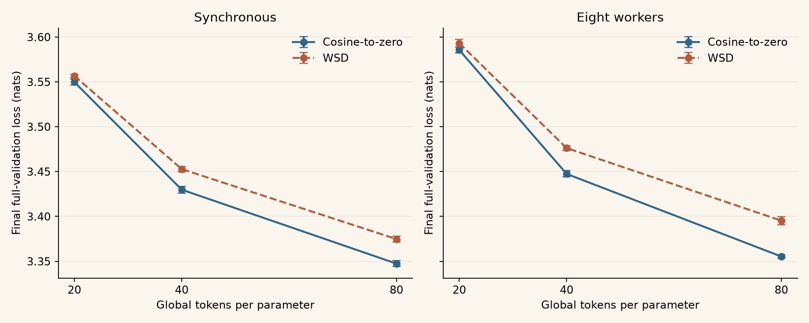
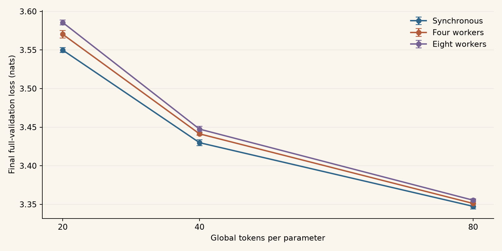

## Cosine-to-zero versus WSD

At 20, 40, and 80 global tokens per parameter, the selected cosine recipes have
lower mean final loss than the selected WSD recipes for both synchronous and
eight-worker training. Each point is the best complete three-seed configuration
within its schedule, training mode, and horizon.

[Figure PDF](../data/current-training/schedule-comparison.pdf) ·
[Interactive results](/tiny-llm/results/explorer/) ·
[All configurations CSV](../data/current-training/configurations.csv)

Cosine and WSD use different search grids and frozen trainer versions. Cosine
starts each horizon afresh; WSD continues from pre-decay checkpoints and prunes
learning rates between horizons. These comparisons describe the measured tuning
outcomes, rather than isolating schedule as the only changed variable.

## Synchronous and decentralized training

Synchronous training has the lowest selected mean loss at each shared horizon.
The four- and eight-worker cosine results approach it as the training budget grows.
All modes use the same global token budget; workers divide that budget, and
decentralized evaluation uses their averaged parameters.

[Figure PDF](../data/current-training/worker-comparison.pdf)

<!-- results:start -->

| Schedule | Training mode | Tokens/parameter | LR | β₁ | β₂ | Final loss ± sample SD |
| --- | --- | ---: | ---: | ---: | ---: | ---: |
| Cosine-to-zero | Synchronous | 20 | 0.01 | 0.9 | 0.99 | 3.549818 ± 0.003284 |
| Cosine-to-zero | Four workers | 20 | 0.01 | 0.95 | 0.99 | 3.570302 ± 0.004893 |
| Cosine-to-zero | Eight workers | 20 | 0.014 | 0.95 | 0.99 | 3.585589 ± 0.003106 |
| WSD | Synchronous | 20 | 0.004 | 0.95 | 0.98 | 3.556699 ± 0.002045 |
| WSD | Eight workers | 20 | 0.006 | 0.95 | 0.999 | 3.593128 ± 0.004363 |
| Cosine-to-zero | Synchronous | 40 | 0.01 | 0.9 | 0.98 | 3.429879 ± 0.003875 |
| Cosine-to-zero | Four workers | 40 | 0.01 | 0.95 | 0.99 | 3.441328 ± 0.001791 |
| Cosine-to-zero | Eight workers | 40 | 0.012 | 0.95 | 0.999 | 3.447451 ± 0.003544 |
| WSD | Synchronous | 40 | 0.004 | 0.95 | 0.98 | 3.452800 ± 0.003136 |
| WSD | Eight workers | 40 | 0.006 | 0.95 | 0.999 | 3.476282 ± 0.002687 |
| Cosine-to-zero | Synchronous | 80 | 0.01 | 0.9 | 0.99 | 3.347422 ± 0.003371 |
| Cosine-to-zero | Four workers | 80 | 0.01 | 0.974 | 0.999 | 3.351158 ± 0.004694 |
| Cosine-to-zero | Eight workers | 80 | 0.012 | 0.974 | 0.999 | 3.355351 ± 0.001988 |
| WSD | Synchronous | 80 | 0.003 | 0.95 | 0.999 | 3.374770 ± 0.003080 |
| WSD | Eight workers | 80 | 0.003 | 0.95 | 0.999 | 3.395320 ± 0.004652 |

<!-- results:end -->

Means and sample SDs use seeds 42, 43, and 44. SD describes seed variation and is
not a confidence interval. Validation is used for tuning; these are not independent
test estimates. Four-worker WSD is unavailable.

## Longer WSD horizons and matched comparisons

WSD also measures 120 and 160 tokens per parameter. Open the
[long-horizon results](/tiny-llm/results/explorer/?schedule=wsd&method=sync&horizon=160)
to inspect them. Cosine has no corresponding measurements at those horizons.

The explorer separates selected winners from comparisons matching horizon, LR,
both AdamW betas, and seeds. A paired SD measures variation in per-seed differences.
Matching hyperparameters does not remove the other protocol differences.

[Matched comparisons CSV](../data/current-training/matched.csv) ·
[All winners JSON](../data/current-training/winners.json)

## Protocol and retained evidence

The [experiment protocol](../methods/protocol.md) explains model and data identity,
budgets, schedules, optimization, evaluation, continuation, and selection.
The publication retains metrics logs and supporting records for every result, including
the continuation parents used to reconstruct WSD curves, grouped into one container per
campaign stage and [mirrored on Hugging Face](https://huggingface.co/datasets/zesen-kth/tiny-llm).

[Per-run records CSV](../data/current-training/runs.csv) ·
[Publication JSON](../data/current-training/dataset.json) ·
[Retained source map](../data/current-training/sources.json) ·
[Checksums](../data/current-training/checksums.json)

The explorer overlays up to eight configurations at once, across schedules, worker
counts, and horizons, as loss trajectories and, in a second figure, the pre-clipping
gradient norms logged at the same training steps. Every seed entry links to the container
holding its metrics, final result, and resolved configuration. The [maintenance guide](../guides/website.md) describes importing
new evidence and regenerating the publication from the retained files.
