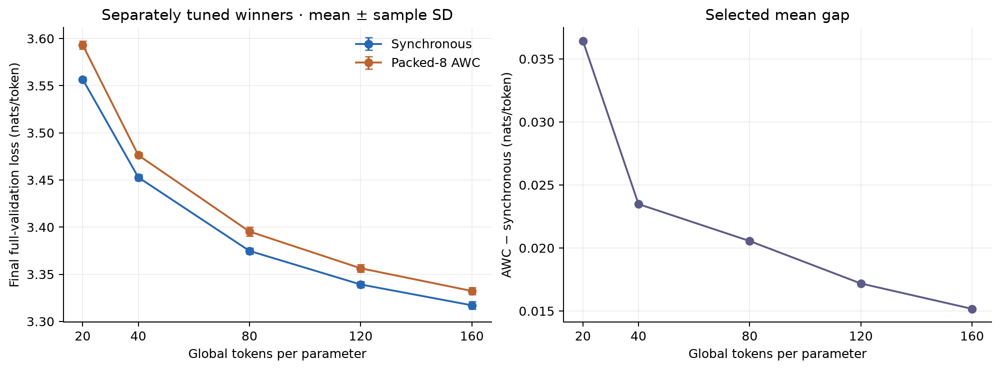

Synchronous training has the lower selected mean final full-validation loss at every measured horizon. Both methods improve with more training, and the gap narrows from **0.036429** nats/token at horizon 20 to **0.015171** at horizon 160. These are comparisons of the best settings retained by each campaign, not unrestricted optima.

The campaigns contain **594 seed/horizon results across 198 configuration/horizon comparisons**: 270 results and 90 configurations for synchronous training; 324 results and 108 configurations for packed-8 adapt-while-combine (AWC). All eligible triples completed seeds 42, 43, and 44. Horizons reuse training history and are not independent repetitions.

Use the [interactive WSD explorer](/tiny-llm/explorer/wsd/) for filters, rankings, seed results, matched comparisons, and recorded trajectories. The [earlier cosine studies](optimizer-tuning.md) remain separate: schedule, search bounds, and token rounding differ, so historical-versus-WSD loss differences do not isolate a schedule effect.

## Winners and training budget

Selection minimizes the arithmetic mean of **final full-validation** cross-entropy after each horizon's decay. Every evaluation covers 197,411,295 prediction targets from the same cached C4 validation split. Values after ± are sample standard deviations over three seeds, not confidence intervals. β₁=0.95 wins throughout both campaigns.

| Horizon | Sync β₂ / LR  |      Sync mean ± SD | AWC β₂ / LR   |       AWC mean ± SD | AWC − sync |
| ------: | ------------- | ------------------: | ------------- | ------------------: | ---------: |
|      20 | 0.98 / 0.004  | 3.556699 ± 0.002045 | 0.999 / 0.006 | 3.593128 ± 0.004363 |   0.036429 |
|      40 | 0.98 / 0.004  | 3.452800 ± 0.003136 | 0.999 / 0.006 | 3.476282 ± 0.002687 |   0.023482 |
|      80 | 0.999 / 0.003 | 3.374770 ± 0.003080 | 0.999 / 0.003 | 3.395320 ± 0.004652 |   0.020551 |
|     120 | 0.999 / 0.003 | 3.339164 ± 0.003378 | 0.999 / 0.003 | 3.356347 ± 0.003996 |   0.017183 |
|     160 | 0.999 / 0.003 | 3.317091 ± 0.003773 | 0.999 / 0.003 | 3.332262 ± 0.003611 |   0.015171 |

[Download comparison PDF](../data/wsd-horizon-tuning/winner-comparison.pdf) · [Winner data and runner-up gaps](../data/wsd-horizon-tuning/winners.csv)

AWC favors β₂=0.999 at all five horizons. Synchronous training selects β₂=0.98 at horizons 20–40 and 0.999 thereafter. AWC selects a higher peak LR at the two shortest horizons; the selected settings coincide from horizon 80 onward. Both methods show diminishing improvements: increasing the horizon from 120 to 160 reduces selected mean loss by 0.022073 for synchronous training and 0.024086 for AWC.

The winning configurations' individual seed losses are:

| Method       | Horizon |     Seed 42 |     Seed 43 |     Seed 44 |
| ------------ | ------: | ----------: | ----------: | ----------: |
| Synchronous  |      20 | 3.554496295 | 3.557062699 | 3.558537303 |
| Synchronous  |      40 | 3.449232908 | 3.455121769 | 3.454045823 |
| Synchronous  |      80 | 3.371351940 | 3.377329036 | 3.375628080 |
| Synchronous  |     120 | 3.335877681 | 3.342626461 | 3.338987472 |
| Synchronous  |     160 | 3.313441292 | 3.320976370 | 3.316854903 |
| Packed-8 AWC |      20 | 3.588105793 | 3.595977846 | 3.595300243 |
| Packed-8 AWC |      40 | 3.473567275 | 3.478940100 | 3.476338400 |
| Packed-8 AWC |      80 | 3.390154356 | 3.399177515 | 3.396629404 |
| Packed-8 AWC |     120 | 3.351924330 | 3.359696545 | 3.357420486 |
| Packed-8 AWC |     160 | 3.328283053 | 3.335329923 | 3.333171678 |

## Close choices and irreversible pruning

Both grids vary β₁ over {0.9, 0.95} and β₂ over {0.9, 0.98, 0.999}. Synchronous LRs are {0.008, 0.006, 0.004, 0.003, 0.002}; AWC additionally tests 0.010. Every beta pair remains eligible at each surviving LR. The global winner's LR becomes the next horizon's ceiling, and pruned values never re-enter. Exact ties favor lower LR, then lower β₁, then lower β₂; no winner required a tie-break.

| Horizon | Sync eligible LRs            | Sync results | AWC eligible LRs                   | AWC results |
| ------: | ---------------------------- | -----------: | ---------------------------------- | ----------: |
|      20 | .008, .006, .004, .003, .002 |           90 | .010, .008, .006, .004, .003, .002 |         108 |
|      40 | .004, .003, .002             |           54 | .006, .004, .003, .002             |          72 |
|      80 | .004, .003, .002             |           54 | .006, .004, .003, .002             |          72 |
|     120 | .003, .002                   |           36 | .003, .002                         |          36 |
|     160 | .003, .002                   |           36 | .003, .002                         |          36 |

At **AWC horizon 80**, LR=0.003 measures 3.395320425 versus 3.395335640 for LR=0.004 with the same betas: a difference of just **0.000015215**. LR=0.004 is better for seeds 42 and 43, while 0.003 is better for seed 44. The prescribed mean-loss rule selects 0.003 and thereby removes 0.004 and 0.006 from horizons 120 and 160. The later data cannot resolve whether 0.004 would have been better at those budgets.

| Method       | Horizon | Runner-up β₁ / β₂ / LR | Runner-up mean ± SD | Gap above winner |
| ------------ | ------: | ---------------------- | ------------------: | ---------------: |
| Synchronous  |      20 | 0.95 / 0.98 / 0.003    | 3.560754 ± 0.002749 |         0.004055 |
| Synchronous  |      40 | 0.95 / 0.98 / 0.003    | 3.453290 ± 0.002846 |         0.000489 |
| Synchronous  |      80 | 0.95 / 0.999 / 0.002   | 3.376895 ± 0.004188 |         0.002126 |
| Synchronous  |     120 | 0.95 / 0.999 / 0.002   | 3.340016 ± 0.003693 |         0.000852 |
| Synchronous  |     160 | 0.95 / 0.999 / 0.002   | 3.317205 ± 0.003836 |         0.000114 |
| Packed-8 AWC |      20 | 0.95 / 0.999 / 0.008   | 3.595219 ± 0.006842 |         0.002091 |
| Packed-8 AWC |      40 | 0.95 / 0.999 / 0.004   | 3.478388 ± 0.005173 |         0.002106 |
| Packed-8 AWC |      80 | 0.95 / 0.999 / 0.004   | 3.395336 ± 0.005893 |         0.000015 |
| Packed-8 AWC |     120 | 0.95 / 0.999 / 0.002   | 3.370868 ± 0.002471 |         0.014521 |
| Packed-8 AWC |     160 | 0.95 / 0.999 / 0.002   | 3.344397 ± 0.003170 |         0.012136 |

All AWC runners-up also use β₁=0.95 and β₂=0.999. The synchronous LR choice at horizon 160 is close as well: 0.003 beats 0.002 by 0.000114 with mixed preferences across seeds. Three-seed means determine the selected winners, but close preferences should not be presented as robust conclusions. Validation was used for tuning; no independent test estimate is reported.

| Figure                  | PDF                                                    | PNG                                                    |
| ----------------------- | ------------------------------------------------------ | ------------------------------------------------------ |
| AWC LR response         | [PDF](../data/wsd-horizon-tuning/awc8-lr-response.pdf) | [PNG](../data/wsd-horizon-tuning/awc8-lr-response.png) |
| AWC heatmaps            | [PDF](../data/wsd-horizon-tuning/awc8-heatmaps.pdf)    | [PNG](../data/wsd-horizon-tuning/awc8-heatmaps.png)    |
| Synchronous LR response | [PDF](../data/wsd-horizon-tuning/sync-lr-response.pdf) | [PNG](../data/wsd-horizon-tuning/sync-lr-response.png) |
| Synchronous heatmaps    | [PDF](../data/wsd-horizon-tuning/sync-heatmaps.pdf)    | [PNG](../data/wsd-horizon-tuning/sync-heatmaps.png)    |

## Matched comparisons

There are **90 matched configuration/horizon comparisons**, pairing the same LR, β₁, β₂, horizon, and runtime seed. The counts by horizon are 30, 18, 18, 12, and 12. Synchronous training has lower mean loss in 88 of 90 matched comparisons; the two AWC-favored settings occur at horizon 20. At every later horizon, all matched configurations favor synchronous training in mean loss. Poor but finite results remain in these comparisons; no seed was removed as an outlier.

These matched comparisons differ from independently tuned winner comparisons: at horizons 20 and 40 the winning optimizer settings differ between methods. Matching optimizer settings still changes local batches, independent optimizer moments, parameter mixing, and the evaluated model. It is a comparison of training systems, not an isolated test of mixing order.

[Matched comparisons CSV](../data/wsd-horizon-tuning/matched.csv) includes every per-seed AWC-minus-synchronous difference, its mean, and the sample SD of paired differences. That SD is distinct from each method's across-seed SD.

## Protocol and continuation

Both campaigns use the same frozen trainer source and token-cache identity. Each local model has 20,403,520 parameters. The global batch is 131,072 tokens, with 128 sequences for synchronous training or 16 sequences per AWC worker. WSD warms up for 312 updates and applies square-root decay over the final 10% of each realized token budget. Preprocessing seed 42 and validation seed 12345 remain fixed.

| Horizon | Global training tokens | Updates | Epochs | Pre-decay checkpoint epoch |
| ------: | ---------------------: | ------: | -----: | -------------------------: |
|      20 |            408,027,136 |   3,113 |     40 |                         35 |
|      40 |            816,185,344 |   6,227 |     80 |                         72 |
|      80 |          1,632,239,616 |  12,453 |    160 |                        143 |
|     120 |          2,448,424,960 |  18,680 |    240 |                        216 |
|     160 |          3,264,610,304 |  24,907 |    320 |                 Not needed |

Budgets divide **global tokens by one model's parameter count**, not by the sum of eight replicas' parameters. Each AWC worker processes one eighth of the global tokens. The trainer evaluates the FP32 parameter average of the eight workers; it does not average their validation losses. Workers are packed on one GH200, so these measurements do not establish physical multi-node speedups.

Each `(β₁, β₂, LR, seed)` continues its own pre-decay checkpoint. Model weights, AdamW moments, RNG state, committed loader cursor, and update/mixing counters persist; warmup does not restart. Each horizon then completes its own decay and full evaluation before promotion.

The curve export follows that lineage recursively. It retains each parent's observations only through the saved cursor and appends the continuation's observations. It never appends a previous terminal decay to a longer-horizon curve. Training-window loss, epoch subset-validation loss, and final full-validation loss remain separate measurements. Seed aggregates use matching recorded token positions without smoothing or added observations.

## Audited data and reproduction

All 594 accepted result files agree with their completion receipts. The publication audit verified 4,404 retained artifact checksums (293.1 GB), including 3,186 averaged/worker weight exports and 30 winning full training states. All 594 reconstructed trajectories have complete epoch coverage, and 396 continuation links were checked. Stored evaluations were audited, not rerun.

Nonwinning full states and retired pre-decay states were intentionally removed by the campaigns' retention policies. Receipts, lineage records, and deletion logs remain; deleted bytes cannot now be rehashed. Original paths in provenance describe the execution environment and are not website download URLs. Checkpoints and runtime environments remain outside the published bundle.

- [All seed results CSV](../data/wsd-horizon-tuning/runs.csv) and [JSON](../data/wsd-horizon-tuning/runs.json)
- [All configuration rankings CSV](../data/wsd-horizon-tuning/configurations.csv)
- [Horizon and pruning coverage](../data/wsd-horizon-tuning/coverage.json)
- [Website dataset](../data/wsd-horizon-tuning/dataset.json), [provenance and audit](../data/wsd-horizon-tuning/provenance.json), and [publication checksums](../data/wsd-horizon-tuning/checksums.json)

The site validates committed data and recorded curves without reading the campaign directories or launching training. The [website-maintenance guide](../guides/website.md#wsd-horizon-campaigns) explains collection and validation. Existing preset files describe earlier recipes; this publication records the WSD winners without changing those presets.
